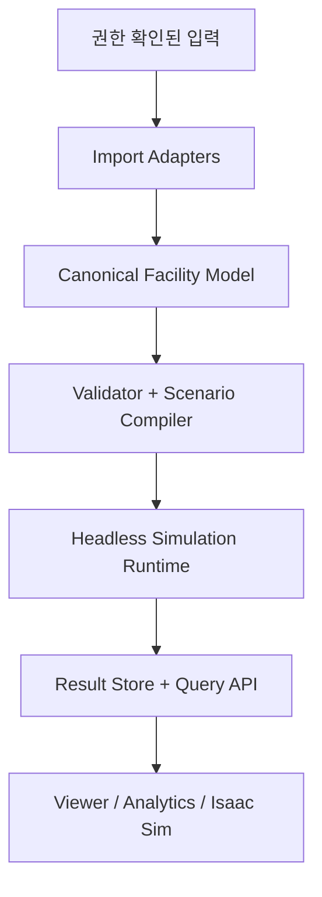
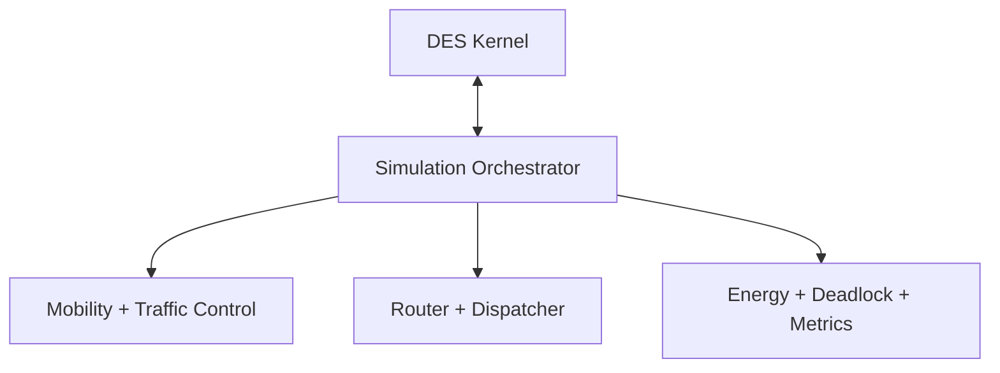
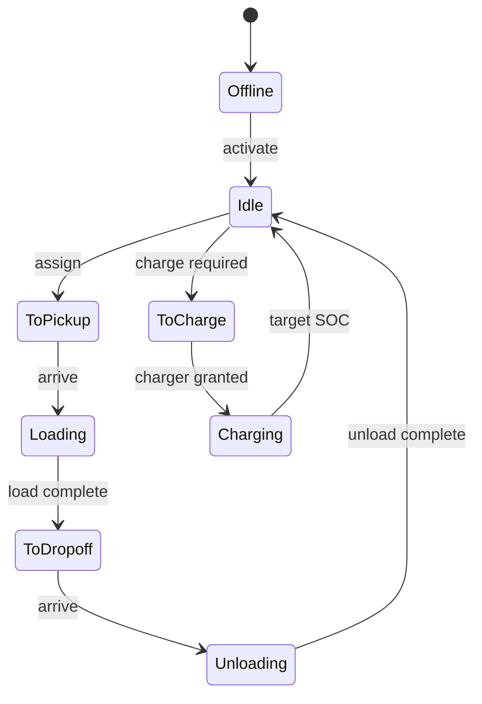

# Sim_Core Simulator Architecture v1

| 항목 | 값 |
|---|---|
| 상태 | 1차 구현 기준선 승인 |
| 버전 | 0.1.0 |
| 작성일 | 2026-07-17 |
| 대상 | FAB OHT 독립 이산사건 시뮬레이터 |
| 기준 자료 | 저장소의 AutoMod·OHT 종합 정적분석 보고서 |

## 1. 결론

Sim_Core는 특정 상용 제품의 실행기나 UI를 재현하는 프로그램이 아니라, **FAB OHT의 수요·배차·경로·교통·교착·에너지 정책을 독립적으로 실험하는 결정론적 헤드리스 시뮬레이터**로 설계합니다.

첫 구현의 중심은 다음 세 축입니다.

1. 여러 레이아웃 포맷을 한 구조로 정규화하는 `Canonical Facility Model`
2. 같은 입력에서 같은 event 순서를 보장하는 `Deterministic DES Kernel`
3. 라우팅·배차·이동·에너지·교착을 교체 가능한 정책으로 분리한 `OHT Domain Modules`

2D/3D Viewer와 Isaac Sim은 코어 상태를 표시하는 소비자이며 시뮬레이션의 시간이나 판정을 소유하지 않습니다.

## 2. 설계 근거와 적용 범위

### 2.1 분석 자료에서 채택한 도메인 사실

| 분석 관찰 | Architecture v1 반영 |
|---|---|
| 프로세스가 중단·재개 가능한 상태기계로 동작 | Vehicle, Job, Operation을 명시적 상태기계로 모델링 |
| 동일 시각 event 처리 순서가 결과와 교착에 영향 | `(time, priority, sequence)`의 전순서 event key 사용 |
| 경로가 직선·원호·Control Point·명시적 attach로 구성 | 방향성 multigraph와 geometry/provenance 분리 |
| 도면상 교차가 실제 연결을 뜻하지 않음 | geometry 근접만으로 node를 연결하지 않는 validator 규칙 |
| 입력 포맷과 모델 시점이 혼재할 수 있음 | immutable model revision과 source hash 기록 |
| 정상, 입력 오류, 교착, 비활성 사례가 각각 존재 | 사례별 목적을 분리한 regression 계층 구성 |
| 상용 런타임의 이동·충돌 세부 규칙은 확인되지 않음 | 독립 정책을 명시하고 fidelity level별로 검증 |

분석 자료에 나타난 `mm`와 `s`, 단방향 경로는 해당 자료의 import profile 기본값으로만 취급합니다. Canonical Model은 단위와 방향을 명시적으로 저장하며 다른 입력까지 같은 값으로 강제하지 않습니다.

### 2.2 포함 범위

- 레이아웃, station, zone, parking, vehicle type의 중립 표현
- 원본 hash와 importer version을 포함한 model revision
- 참조, 단위, geometry, 연결성, 운영 제약 검증
- 차량, 운송 요청, 작업, 자원, 예약 상태기계
- 결정론 event queue, 취소, 재개, named random stream
- Dijkstra 기반 routing과 deterministic dispatch
- 단계별 mobility 및 traffic-control policy
- SOC, charger resource, charging policy
- wait-for graph 기반 deadlock 탐지와 설명
- event trace, 상태 전이, interval metrics, run manifest
- CLI 우선의 validate, run, replay, compare 흐름

### 2.3 제외 범위

- 상용 시뮬레이터 실행 파일, DLL, 라이선스 체계, 내부 API의 복제
- 권한이 확인되지 않은 소스 코드, UI, 아이콘, 문구의 재사용
- 미확인 proprietary binary를 제품의 필수 입력으로 삼는 구조
- 1차 단계에서 상용 엔진과 수치가 완전히 같다는 주장
- 3D physics engine을 OHT 운영 판정의 기준으로 사용하는 구조
- 운영 OCS/DB에 대한 write-back 또는 실장비 제어

## 3. 품질 목표

우선순위는 `재현성 → 설명 가능성 → 입력 안전성 → 확장성 → 성능 → 시각화` 순서입니다.

| 품질 속성 | Architecture rule | 1차 합격 기준 |
|---|---|---|
| 결정론 | 모든 event에 전순서 key 부여 | 동일 run을 10회 실행해 event hash 일치 |
| 설명 가능성 | 상태 전이에 cause event와 reason code 기록 | BLOCKED 상태의 대기 자원을 항상 조회 가능 |
| 입력 안전성 | 실행 전에 structural/graph/operational validation | dangling reference와 unreachable station을 실행 전 차단 |
| 추적성 | source hash, revision, scenario hash 보존 | 결과에서 입력과 엔진 버전을 역추적 가능 |
| 모듈성 | Kernel과 domain policy를 port로 분리 | Dispatch policy 교체 시 Kernel 수정 없음 |
| 성능 | single-writer event loop와 immutable graph | 목표 workload 기준은 구현 단계에서 benchmark로 고정 |
| 연동성 | Viewer와 외부 도구는 versioned snapshot/event 계약 사용 | Isaac Sim 없이도 전 기능 headless test 가능 |

## 4. 전체 구조



### 4.1 Dependency rule

1. `domain`과 `kernel`은 파일 포맷, DB, UI framework를 참조하지 않습니다.
2. Import Adapter는 원본 데이터를 Canonical Model로 변환하고 원본 객체를 runtime에 전달하지 않습니다.
3. Domain module은 다른 module의 내부 상태를 직접 수정하지 않고 command, query port, domain event를 사용합니다.
4. Result consumer는 simulation state를 수정하지 않습니다.
5. 좌표와 단위 변환은 import/compile 경계에서 끝내고 runtime 내부 단위를 하나로 고정합니다.
6. runtime의 authoritative mutation은 event-loop thread 하나만 수행합니다.

### 4.2 주요 component

| Component | 책임 | 입력 | 출력 | 책임이 아닌 것 |
|---|---|---|---|---|
| Import Adapter | 원본 parsing, ID namespace, 단위 변환, provenance | 승인된 file/record | Canonical draft + import report | 연결성 보정의 자동 추측 |
| Canonical Model | 시설 geometry와 운영 topology의 중립 표현 | Canonical draft | immutable model revision | 시나리오별 차량 상태 |
| Validator | structural, geometry, graph, operational rule 검사 | model revision | diagnostic set | 오류를 임의로 숨기는 자동 수정 |
| Scenario Compiler | model과 정책을 executable run plan으로 결합 | model, scenario | compiled scenario | event 실행 |
| DES Kernel | 시간, event queue, 취소, 재개, RNG | scheduled event | ordered event dispatch | OHT 배차 정책 |
| Mobility | edge/node/zone 예약과 이동 상태 | route, vehicle state | movement event | 최적 차량 선정 |
| Router | 제약을 반영한 경로 계산과 cache | graph, cost snapshot | route plan | 차량 상태 mutation |
| Dispatcher | 후보 제외, 점수 계산, assignment 결정 | jobs, fleet snapshot | assignment command + decision log | 이동 예약 |
| Energy | SOC, 소비, charging resource | movement/idle event | energy state + charge job | 경로 점유 판단 |
| Deadlock | wait-for graph 구성, cycle 탐지·진단 | wait/release event | deadlock report | 기본값에서 강제 recovery |
| Metrics | online aggregate와 interval snapshot | domain event | metric records | domain state의 원본 보관 |
| Result Store | manifest, event, transition, metric 저장 | versioned records | query/replay stream | simulation 의사결정 |

## 5. Canonical Facility Model

### 5.1 Revision aggregate

`FacilityModelRevision`은 import가 끝난 뒤 불변입니다. 편집이나 재변환은 기존 객체를 덮어쓰지 않고 새 revision을 만듭니다.

필수 metadata는 다음과 같습니다.

- `revision_id`
- `schema_version`
- `source_artifacts[]`: kind, namespace, SHA-256, importer name/version
- `source_units`와 `canonical_units`
- `coordinate_reference`
- `created_at`
- `diagnostic_summary`
- 정렬된 canonical payload로 계산한 `content_hash`

### 5.2 핵심 entity

| Entity | 필수 항목 | 핵심 invariant |
|---|---|---|
| Node | id, position, layer, role, source refs | 좌표와 ID가 유효하며 edge endpoint로 참조 가능 |
| Edge | id, from, to, geometry, length, speed, direction | 길이 양수, endpoint 존재, geometry와 길이 일관 |
| ControlPoint | id, parent edge, offset, role | `0 ≤ offset ≤ edge.length` |
| Station | id, attachment, operation type, compatibility | attachment가 유효한 이동 위치를 가리킴 |
| Zone | id, entries, exits, capacity, policy type | capacity 양수, 경계 참조 유효 |
| Parking | id, attachment, eligibility, queue policy | 접근 가능한 위치이며 수용 규칙 명시 |
| Charger | id, attachment, capacity, charge profile | capacity와 SOC 정책 유효 |
| VehicleType | geometry, speed, acceleration, load compatibility | 물리값 양수, 단위 명시 |

Network는 **방향성 multigraph**입니다. 같은 node 쌍 사이에 geometry나 정책이 다른 여러 edge를 허용합니다.

### 5.3 Geometry와 connectivity 분리

- 직선과 원호는 원본 parameter와 계산된 canonical geometry를 함께 보존합니다.
- Control Point는 좌표만 저장하지 않고 parent edge와 offset을 보존합니다.
- 명시적 attach가 edge 내부를 가리킬 때만 host edge를 논리적으로 분할합니다.
- endpoint coincidence는 importer profile의 tolerance와 layer 조건을 통과해야 합니다.
- 단순한 2D 선 교차는 연결 근거가 아닙니다.
- 모든 분할·병합 결과는 원본 `source_id` 집합으로 역추적할 수 있어야 합니다.

### 5.4 Diagnostic model

모든 진단은 다음 공통 구조를 사용합니다.

```json
{
  "severity": "ERROR",
  "code": "GRAPH_UNREACHABLE_STATION",
  "entity_type": "station",
  "entity_id": "ST-1204",
  "source_refs": ["layout:station:1204"],
  "message": "출발 가능한 경로에서 station에 도달할 수 없습니다.",
  "details": {"component_id": "C-7"}
}
```

진단 category는 `STRUCTURAL`, `UNIT`, `GEOMETRY`, `GRAPH`, `OPERATIONAL`, `SCENARIO`, `SECURITY`로 고정합니다. `ERROR`가 하나라도 있으면 기본 실행을 금지하고, 예외 실행은 manifest에 명시적으로 남깁니다.

## 6. Scenario Model과 Compile 단계

`ScenarioDefinition`은 시설 모델과 분리합니다. 같은 layout을 차량 수, 수요, seed, 정책만 바꾸어 반복 실행할 수 있어야 합니다.

필수 항목은 다음과 같습니다.

- scenario ID와 schema version
- model revision ID/hash
- simulation duration과 warm-up/snapshot interval
- master seed와 named RNG stream 정의
- fleet와 initial vehicle placement
- demand source와 release policy
- routing, dispatch, mobility, energy, deadlock policy ID/version
- 허용한 validation warning과 runtime limit

Compile 단계는 다음을 수행합니다.

1. 모든 참조를 내부 numeric handle로 resolve합니다.
2. 입력 단위를 canonical runtime 단위로 변환합니다.
3. graph adjacency와 static routing index를 생성합니다.
4. policy parameter를 schema로 검증합니다.
5. 초기 vehicle/resource 상태를 검증합니다.
6. 정렬된 model+scenario+policy payload로 `run_fingerprint`를 계산합니다.

## 7. Deterministic DES Kernel

### 7.1 Simulation time

Runtime 시간은 부동소수점 초가 아니라 `int64` microsecond tick을 사용합니다.

- 외부의 초 단위 실수는 compile 경계에서 명시적 rounding policy로 변환합니다.
- event handler는 현재 시각보다 과거 event를 예약할 수 없습니다.
- 같은 시각의 event는 priority와 insertion sequence로 완전히 정렬합니다.
- duration 계산에서 overflow를 검사합니다.

### 7.2 Event envelope

```text
EventEnvelope
  event_id
  sim_time_us
  priority
  insertion_sequence
  event_type
  payload_version
  entity_type / entity_id
  cause_event_id
  correlation_id
  cancellation_generation
```

정렬 key는 `(sim_time_us, priority, insertion_sequence)`입니다. `event_id`는 추적용이며 정렬에 사용하지 않습니다.

Priority의 의미 순서는 다음과 같이 중앙 registry에서 관리합니다.

1. resource release와 safety unblock
2. 이동·작업 완료
3. 상태 전이 후속 처리
4. 수요 release와 dispatch tick
5. metric snapshot과 observer notification

숫자 범위는 구현 때 상수로 고정하고 module이 임의 숫자를 직접 사용하지 못하게 합니다.

### 7.3 Scheduler 규칙

- 우선순위 queue는 min-heap을 사용합니다.
- 취소는 queue 내부 삭제 대신 generation/tombstone으로 처리합니다.
- event handler 하나는 atomic state transition을 만들고 후속 event를 예약합니다.
- 한 timestamp에서 처리 가능한 zero-delay event 수에 guard를 둡니다.
- 처리 중 예외가 발생하면 run을 `FAILED`로 종료하고 마지막 committed event를 기록합니다.
- event loop의 state mutation은 single writer입니다.

### 7.4 Random stream

전역 RNG 하나를 공유하지 않습니다. `demand`, `service`, `dispatch_tie`, `failure`처럼 이름이 있는 stream을 사용하고 `master_seed + stream_name + stream_version`으로 독립 seed를 파생합니다.

이 방식은 한 module의 난수 호출 수가 변해 다른 module 결과까지 흔들리는 것을 막습니다. 각 결과 manifest에는 stream algorithm과 version을 기록합니다.

### 7.5 Runtime 내부 구조



Kernel은 domain event 의미를 모르고, Orchestrator가 handler registry를 통해 event를 module에 전달합니다.

## 8. OHT Domain State Machine

### 8.1 Vehicle



`Parking`, `Blocked`, `Error`는 공통 side state로 두되, 복귀할 이전 상태와 대기 원인을 함께 기록합니다. 단순 enum 변경을 금지하고 `TransitionVehicleState` command만 상태를 바꿉니다.

각 transition record에는 다음 값이 필요합니다.

- 이전/다음 상태
- vehicle ID와 현재 job ID
- simulation time
- cause event ID
- reason code
- 위치/edge/reservation snapshot reference

### 8.2 Transport Job

Job 상태는 `CREATED → QUEUED → ASSIGNED → PICKING → IN_TRANSIT → COMPLETED`가 정상 흐름입니다. `CANCELLED`, `REJECTED`, `FAILED`는 reason code가 필수입니다.

Job과 Vehicle은 서로의 상태를 직접 소유하지 않습니다. Assignment aggregate가 결합 관계와 version을 관리해 중복 배차와 stale command를 차단합니다.

### 8.3 Resource와 reservation

Edge block, node, zone, station, charger는 공통 resource contract를 사용합니다.

```text
request(resource_id, vehicle_id, interval_or_quantity)
grant(request_id)
occupy(grant_id)
release(grant_id)
timeout(request_id)
```

각 대기에는 `waiting_vehicle → requested_resource → current_holder` 관계를 남겨 Deadlock module이 wait-for graph를 구성할 수 있게 합니다.

## 9. Domain Modules

### 9.1 Routing

1차 route cost는 자유주행시간입니다.

```text
free_flow_time = edge_length / allowed_speed
```

이후 versioned cost policy로 queue delay, zone penalty, turn penalty, energy cost, prohibition을 추가합니다.

- 정적 graph는 model revision 단위로 cache합니다.
- 동적 비용은 traffic snapshot version을 key로 제한된 시간 동안 cache합니다.
- 금지와 높은 비용을 구분합니다.
- 경로 없음은 빈 route가 아니라 reason code가 있는 실패 결과입니다.
- tie는 edge ID의 canonical ordering으로 결정합니다.

초기에는 Dijkstra를 사용하고 all-pairs precompute는 benchmark 근거가 있을 때만 추가합니다.

### 9.2 Dispatch

Dispatch는 두 단계입니다.

1. `CandidateFilter`: offline, incompatible, unreachable, insufficient SOC, already assigned, zone limit 등의 제외 이유 생성
2. `ScoringPolicy`: pickup ETA, congestion, battery risk, zone balance, job age를 비교

동점은 stable vehicle ID 순서나 versioned deterministic tie-break로 해결합니다. 선택된 차량뿐 아니라 모든 주요 탈락 이유를 `DispatchDecision`에 남깁니다.

### 9.3 Mobility fidelity

| Level | 기능 | 용도 |
|---|---|---|
| F0 | 거리/속도로 완료 시각만 계산 | Kernel과 routing 검증 |
| F1 | edge 또는 block 단일 점유 | 첫 MVP와 기본 혼잡 |
| F2 | headway와 node reservation | OHT 추종과 합류 대기 |
| F3 | 위치, 가감속, 안전거리, stop point | 이동 충실도 향상 |
| F4 | ZCU/HID/FlowControl, 교착 회복 정책 | FAB 운영 실험 |

한 run은 하나의 fidelity profile을 manifest에 명시합니다. 서로 다른 level 결과를 같은 기준인 것처럼 비교하지 않습니다.

### 9.4 Traffic control

Zone, HID, Flow Control은 공통 reservation port를 구현하는 별도 policy입니다. layout 데이터는 resource 경계를 정의하고 policy는 승인 순서를 정의합니다.

기본 policy는 다음을 명시해야 합니다.

- request ordering
- capacity
- entry/exit lifecycle
- timeout
- controller failure 시 fail-safe 동작
- recovery가 deterministic한지 여부

### 9.5 Energy

1차는 거리 기반 선형 소비와 charger capacity resource를 구현합니다. Scenario에는 다음 SOC 값을 명시합니다.

- dispatch 최소 SOC
- 작업 후 예상 SOC safety margin
- charge 시작 SOC
- charge 종료 target SOC
- emergency SOC

배차 전 `job route + charger reachability`를 함께 검사합니다. 충전 대기와 충전기로 가는 경로 점유는 별도 metric으로 남깁니다.

### 9.6 Deadlock

단순히 일정 시간 완료가 없다는 이유만으로 deadlock을 선언하지 않습니다.

탐지는 다음 증거를 결합합니다.

- wait-for graph에 cycle 존재
- cycle 구성 차량이 모두 진행 불가
- cycle을 해제할 이미 예약된 future event가 horizon 안에 없음
- backlog 또는 blocked set이 유지됨

보고서는 cycle의 vehicle, resource, holder, request, route position, cause event를 포함합니다. 기본 정책은 `detect_only`이며 recovery는 별도 policy와 별도 실험군으로 취급합니다.

## 10. Result, Trace, Replay

### 10.1 Run manifest

모든 실행 결과는 다음 값을 포함합니다.

- run ID와 run fingerprint
- model revision/hash
- scenario hash
- engine version와 build ID
- policy ID/version/parameter hash
- master seed와 RNG stream version
- runtime unit과 rounding policy
- fidelity level
- validation warning 목록
- 시작/종료 상태와 실패 원인

### 10.2 Record 종류

| Record | 목적 | 최소 필드 |
|---|---|---|
| EventTrace | 처리 순서 재현 | event envelope, payload hash, handler result |
| StateTransition | Vehicle/Job/Resource 변화 설명 | before, after, reason, cause event |
| DispatchDecision | 후보 선택 설명 | selected, excluded reasons, score terms |
| MovementRecord | 이동과 점유 분석 | route, enter/exit time, wait, distance |
| DeadlockReport | cycle 진단 | wait-for cycle, resources, future event check |
| MetricSnapshot | 구간 통계 | interval, throughput, backlog, utilization, SOC |

1차 저장 형식은 사람이 검토할 수 있는 versioned JSON/JSONL을 사용합니다. 대용량 분석이 필요해지면 동일 logical schema를 Parquet 또는 columnar store로 투영합니다. 저장 형식이 domain event class를 지배하지 않도록 mapper를 둡니다.

### 10.3 Replay 수준

- `Trace replay`: 저장된 transition을 재생해 viewer와 분석을 검증
- `Deterministic rerun`: model+scenario+seed로 다시 실행해 event hash 비교
- `Checkpoint resume`: 안정화 이후 snapshot과 event offset에서 재개

첫 구현은 deterministic rerun을 우선하며 checkpoint resume는 뒤로 미룹니다.

## 11. 외부 Interface

### 11.1 CLI use case

```text
sim-core import   --input <authorized-source> --output <model-revision>
sim-core validate --model <model-revision>
sim-core compile  --model <model-revision> --scenario <scenario>
sim-core run      --compiled <run-plan> --results <directory>
sim-core replay   --results <directory>
sim-core compare  --baseline <run-a> --candidate <run-b>
```

실제 option 이름은 CLI 구현 시 확정하지만 use case 경계는 유지합니다.

### 11.2 Viewer와 Isaac Sim

연동은 다음 두 stream으로 제한합니다.

- immutable facility snapshot
- timestamped entity state/transition stream

Viewer가 느리거나 연결이 끊겨도 core time은 영향을 받지 않습니다. 실시간 표현이 필요하면 wall-clock pacing adapter가 simulation time을 따라가며, core event scheduler 자체를 wall clock에 종속시키지 않습니다.

### 11.3 운영 시스템 연동

초기 OCS/DB adapter는 read-only staging만 허용합니다. 자격증명은 저장소나 scenario에 기록하지 않고 secret provider로 주입합니다. 외부 ID는 namespace를 붙여 canonical ID와 분리합니다.

## 12. C++20 구현 구조

### 12.1 선택

- Core와 domain module: C++20
- Build: CMake 기반의 재현 가능한 out-of-source build
- Core public API: 좁은 C++ interface와 versioned data contract
- Python/Isaac Sim: core가 안정된 뒤 binding 또는 out-of-process adapter
- Kernel hot path: 표준 library 중심, 외부 framework 의존 최소화

### 12.2 Package 방향

```text
apps -> application -> modules -> domain
                    -> kernel
adapters -> ports <- application
bindings -> public API
```

`domain`과 `kernel` 사이에는 OHT-specific event payload를 해석하는 역방향 의존이 없습니다. Application layer가 runtime context와 handler를 조립합니다.

### 12.3 Concurrency

- event ordering과 state commit은 단일 thread가 담당합니다.
- route precompute, immutable model validation, 결과 compression처럼 순수하거나 분리 가능한 작업만 parallel 처리합니다.
- parallel 결과는 canonical key 순서로 merge해 실행마다 ordering이 달라지지 않게 합니다.

멀티스레드는 benchmark가 병목을 증명한 뒤 추가합니다.

## 13. 검증 전략

### 13.1 Test pyramid

| 계층 | 대상 | 예시 |
|---|---|---|
| Unit | time, queue, state machine, graph | 동률 event 순서, 과거 예약 거부 |
| Contract | schema와 port | importer output, result record version |
| Property | graph와 scheduler invariant | event time 단조성, reservation 중복 금지 |
| Golden synthetic | 독립 생성 소형 모델 | 직선, 원호, attach, dispatch tie, zone capacity |
| Reference regression | 권한 확인된 정제 사례 | 정상 흐름, 입력 결함, 포화·교착, revision mismatch |
| Performance | 고정 workload | events/s, memory, routing latency |

### 13.2 필수 golden case

1. 단일 edge와 차량 1대의 정확한 도착 시각
2. 같은 시각 event 세 개의 priority/sequence 순서
3. 취소된 event가 실행되지 않는지 확인
4. attach가 없는 X 교차 경로가 연결되지 않는지 확인
5. 동일 거리 차량 두 대의 deterministic dispatch tie
6. capacity 1 zone에 차량 두 대가 순차 진입
7. 작업 완료 후 SOC가 부족할 때 charging 전환
8. 차량 세 대의 wait cycle과 deadlock report
9. source row count와 실제 record count mismatch 진단
10. 차량 0대 시나리오에서 요청만 증가하고 완료가 없는 정상 설명

### 13.3 분석 사례의 역할

| 사례 유형 | 검증 목적 | 합격 판단 |
|---|---|---|
| 소규모 정상 사례 | 생성→배차→픽업→배송 | 흐름과 처리량 추세가 설명 가능 |
| 입력 결함 사례 | park/start/connectivity 오류 | 실행 전에 구조화된 오류로 차단 |
| 대규모 포화 사례 | 혼잡과 wait cycle | 병목과 deadlock 구성 요소를 보고 |
| revision 불일치 사례 | 의도 모델과 실행 모델 구분 | hash/revision 차이를 결과에 명시 |

원본 사례는 권리·보안 검토 후 정제된 fixture만 사용하며 제품 저장소에 원문을 복제하지 않습니다.

## 14. 1차 구현 Vertical Slice

Architecture 다음 커밋의 권장 범위입니다.

1. CMake/C++20 project skeleton
2. `SimulationTime`, `EventEnvelope`, deterministic priority queue
3. Canonical JSON schema의 Node/Edge/Station 최소 집합
4. structural/graph validator
5. F0 movement와 Dijkstra
6. Vehicle/Job 최소 상태기계와 nearest-feasible dispatch
7. JSONL event trace와 run manifest
8. 단일 직선 network golden test

완료 조건은 다음과 같습니다.

- 차량 1대와 job 1건이 `IDLE → TO_PICKUP → LOADING → TO_DROPOFF → UNLOADING → IDLE`로 완료됩니다.
- 같은 scenario를 반복 실행했을 때 event trace hash가 같습니다.
- 도달 불가능한 station은 실행 전에 차단됩니다.
- core test는 UI, Isaac Sim, 상용 runtime 없이 실행됩니다.

## 15. 단계별 Roadmap

| 단계 | 산출물 | 종료 조건 |
|---|---|---|
| A0 Governance | 사용 가능 자료와 금지 자료 구분, secret 제거 | 개발 fixture 승인 |
| A1 Foundation | schema, validator, deterministic kernel | synthetic golden test 통과 |
| A2 OHT MVP | F0/F1 이동, routing, dispatch, metrics | 정상 축소 scenario 완주 |
| A3 Traffic | F2/F3, zone/node reservation | 혼잡과 대기 원인 설명 |
| A4 Diagnostics | wait-for graph, deadlock detect-only | cycle 구성 entity 보고 |
| A5 Energy | SOC, charger, charge dispatch | 충전 혼잡 민감도 분석 |
| A6 Productization | 2D, API, Isaac Sim projection | headless 결과와 화면 일치 |

## 16. 확정 결정과 보류 결정

### 16.1 확정

- 독립 구현과 clean-room 경계
- Canonical Facility Model 중심 구조
- C++20 헤드리스 코어
- 정수 simulation time과 전순서 event queue
- single-writer deterministic runtime
- UI/Isaac Sim 비권위 consumer
- detect-only deadlock 기본값

### 16.2 구현 전에 수치 확정이 필요한 항목

- canonical 좌표계와 geometry tolerance
- microsecond 변환 rounding policy
- event priority 숫자 registry
- vehicle kinematic parameter와 safety distance
- dispatch score의 초기 항과 가중치
- SOC 소비/충전 curve
- benchmark workload와 성능 목표
- 원본 포맷 adapter별 사용 권한과 fixture 범위

이 항목은 추정값으로 숨기지 않고 scenario 또는 policy version에 명시합니다.
