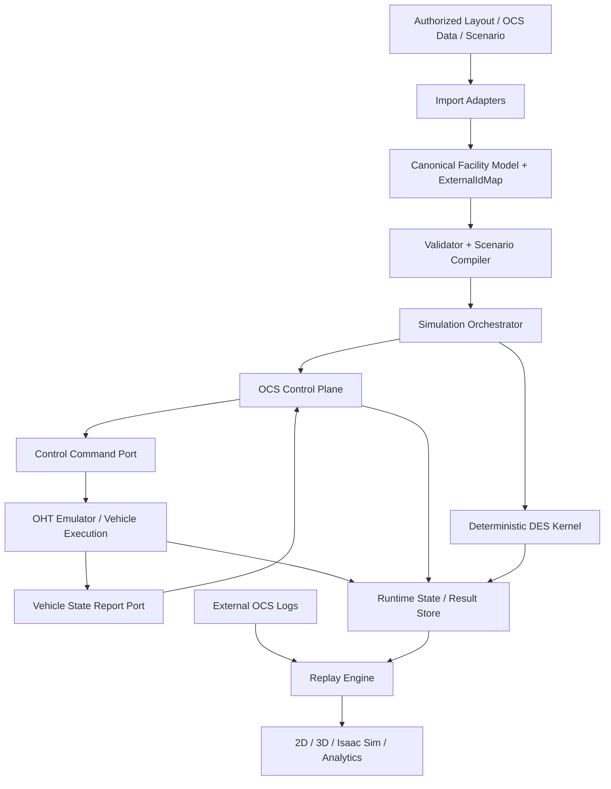

# Sim_Core Simulator Architecture v2

| 항목 | 값 |
|---|---|
| 상태 | Job_Tasks OHT Emulator / OCS / Replay 비교 반영 기준선 |
| 버전 | 0.2.0 |
| 작성일 | 2026-07-18 |
| 대상 | FAB OHT 독립 이산사건 시뮬레이터 |
| 이전 기준 | `SIM_CORE_ARCHITECTURE_V1.md` |

## 1. 변경 결론

Architecture v1의 핵심 원칙인 `Canonical Facility Model`, 결정론적 DES, 교체 가능한 routing/dispatch/mobility policy는 유지합니다.

다만 Job_Tasks에서 사용해 온 OHT 메인 에뮬레이터, OCS 프로그램, OCS Replay 프로그램의 역할을 비교하면 기존 v1은 다음 경계가 부족합니다.

1. OCS의 운영 의사결정과 차량 실행 모델의 역할이 하나의 Runtime 안에 다소 평면적으로 표현돼 있습니다.
2. Replay가 Sim_Core 자체 결과 재생 중심으로 정의돼 실제 OCS 로그 기반 재현과 구분되지 않습니다.
3. 외부 OCS Node ID와 내부 그래프 ID의 명시적 매핑 계층이 없습니다.
4. 차량 상태가 node 중심으로만 축약될 경우 향후 연속 위치, 속도, 방향, 적재, Job phase를 표현하기 어렵습니다.
5. 실제 운영 연동을 고려한 command/state 계약과 emulator boundary가 부족합니다.

따라서 v2에서는 시스템을 다음 네 층으로 명확히 분리합니다.

- `OCS Control Plane`: Job, route, dispatch, traffic/yield 등 운영 의사결정
- `Simulation Runtime`: 결정론적 시간과 event 실행
- `OHT Emulator / Vehicle Execution`: 차량 명령 실행, 이동 및 장비 동작 모델
- `Replay & Observation`: 실제 OCS 로그 또는 Sim_Core trace를 시간축으로 재생

## 2. Job_Tasks 구조와 기존 v1 비교

| 비교 항목 | Job_Tasks에서 확인된 구조적 특징 | v1 상태 | v2 반영 |
|---|---|---|---|
| 운영 로직 | OCS가 JobAssign, PathSearch, Traffic/Yield 등 상위 의사결정 담당 | Router/Dispatcher/Mobility가 같은 Runtime 계층에 배치 | `OCS Control Plane` 논리 경계 추가 |
| 차량 실행 | Emulator가 차량 이동, 정지, station 도착, command 실행을 담당 | Mobility 중심으로만 정의 | `Vehicle Execution Engine` 명시 |
| 시간 진행 | 이벤트 기반 또는 세부 이동 단계 실행 | DES 단일 관점 | DES를 authoritative time으로 유지하고 execution fidelity를 하위 계층화 |
| Replay | OCS 로그/상태 기록을 시간순 재생 | 내부 transition replay 중심 | `External Log Replay`와 `Internal Trace Replay` 분리 |
| 차량 상태 | node/resource/route 외 연속 좌표·속도·방향 필요 | F3에만 추상적으로 위치 | `VehicleKinematicState` 계약 추가 |
| ID 체계 | OCS Node ID와 내부 graph ID 매핑 필요 | namespace 원칙만 존재 | `ExternalIdMap`을 Canonical revision 필수 산출물로 추가 |
| 통신 | OCS ↔ Emulator 간 command/state 형태가 자연스러운 경계 | 내부 module command만 정의 | versioned `ControlCommand` / `VehicleStateReport` port 추가 |

## 3. 전체 구조



핵심 원칙은 다음과 같습니다.

- DES Kernel만 simulation time을 소유합니다.
- OCS Control Plane은 의사결정을 소유하지만 시간을 직접 진행시키지 않습니다.
- Vehicle Execution은 명령을 실제 상태 변화로 변환하지만 Job 배차 정책을 결정하지 않습니다.
- Replay Engine은 상태를 재생할 뿐 live simulation state를 수정하지 않습니다.

## 4. OCS Control Plane

OCS Control Plane은 실제 OCS의 전체 제품 구조를 복제하는 계층이 아니라 FAB 운영 의사결정을 독립적으로 구현하는 논리 영역입니다.

구성 모듈:

- `DemandManager`: 운송 요청 생성·입력
- `JobManager`: Job lifecycle과 queue
- `Dispatcher`: 차량 후보 선정과 assignment
- `Router`: path search와 reroute
- `TrafficCoordinator`: zone, HID, yield, flow-control 정책
- `FleetManager`: 차량 availability, parking, charging 상태 조회

OCS Control Plane은 차량 상태를 직접 변경하지 않고 `ControlCommand`를 발행합니다.

```text
ControlCommand
  command_id
  command_type
  target_vehicle_id
  job_id
  route_revision
  route_segments[]
  target_station_id
  issued_at_sim_time_us
  expected_state_version
  correlation_id
```

예시 command type:

- `ASSIGN_JOB`
- `SET_ROUTE`
- `MOVE`
- `STOP`
- `RESUME`
- `LOAD`
- `UNLOAD`
- `PARK`
- `GO_CHARGE`

`expected_state_version`을 사용해 오래된 command가 최신 차량 상태를 덮어쓰는 것을 차단합니다.

## 5. OHT Emulator / Vehicle Execution Engine

Vehicle Execution Engine은 OCS가 내린 명령을 물리·논리 차량 동작으로 변환합니다.

### 5.1 책임

- 현재 위치와 route progression
- acceleration/deceleration과 travel time
- edge/node/zone reservation 소비
- stop/in-position
- station 접근 및 도착
- load/unload 또는 hoist/slide service time
- command completion/failure 보고

### 5.2 비책임

- 어떤 Job을 선택할지 결정
- 전체 fleet 최적화
- 다른 차량의 배차 우선순위 결정
- 실제 OCS DB에 write-back

### 5.3 VehicleRuntime 확장

기존 최소 node 기반 상태만으로 제한하지 않고 다음 구조를 사용합니다.

```text
VehicleRuntime
  vehicle_id
  state_version
  mode
  current_node
  current_edge
  edge_progress
  position_xyz
  yaw
  velocity
  acceleration
  load_state
  current_job_id
  job_phase
  active_command_id
  route_segments[]
  route_index
  occupied_resources[]
  reserved_resources[]
  blocked_reason
```

F0/F1에서는 일부 연속 값이 계산되지 않을 수 있지만 schema 자체는 유지하고 `validity mask` 또는 optional field로 fidelity 차이를 표현합니다.

## 6. OCS ↔ Emulator State Contract

Vehicle Execution은 상태 변화 시 `VehicleStateReport`를 생성합니다.

```text
VehicleStateReport
  vehicle_id
  state_version
  sim_time_us
  mode
  position
  route_position
  velocity
  load_state
  job_id
  job_phase
  command_id
  occupied_resources[]
  reserved_resources[]
  fault_or_block_reason
```

Control Plane은 이 report의 snapshot을 읽어 다음 배차·경로·교통 판단을 수행합니다.

동일 프로세스 내부 구현에서도 이 command/state 계약을 유지합니다. 초기에는 함수 호출이나 in-memory queue를 사용할 수 있지만 계약 자체는 향후 IPC/TCP/gRPC adapter로 바꿀 수 있어야 합니다.

## 7. Canonical Model과 External ID Mapping

OCS 및 기존 Emulator 계열 데이터는 원본 Node ID를 유지할 필요가 있습니다. 내부 numeric handle 재배치와 외부 ID를 혼용하지 않습니다.

모든 `FacilityModelRevision`은 다음 매핑을 함께 생성합니다.

```text
ExternalIdMap
  source_namespace
  source_entity_type
  source_id
  canonical_id
  runtime_handle
  revision_id
```

예:

```text
ocs37:node:0x12AF -> canonical:node:N-002341 -> runtime_handle:871
```

규칙:

1. 외부 로그 Replay는 먼저 `source_id -> canonical_id`로 변환합니다.
2. runtime handle은 revision 내부 최적화용이며 결과 파일의 영구 식별자로 사용하지 않습니다.
3. 매핑 실패는 자동 추측하지 않고 `UNMAPPED_EXTERNAL_ID` 진단으로 남깁니다.
4. 같은 source ID라도 namespace 또는 revision이 다르면 별개로 취급합니다.

## 8. Replay 아키텍처 수정

Replay는 두 종류를 분리합니다.

### 8.1 Internal Trace Replay

Sim_Core 실행 결과의 `EventTrace`, `StateTransition`, `MovementRecord`를 재생합니다.

목적:

- 결과 시각화
- viewer 회귀 검증
- 특정 시각 상태 탐색
- run 비교

이 모드는 simulation logic을 다시 실행하지 않습니다.

### 8.2 External OCS Log Replay

실제 또는 권한 확인된 OCS 로그를 읽어 Canonical timeline으로 변환합니다.

파이프라인:

```text
OCS Raw Log
 -> Log Parser
 -> ExternalIdMap
 -> Canonical Replay Event
 -> Timeline Normalizer
 -> Replay State Reducer
 -> Viewer / Analytics / Isaac Sim
```

`CanonicalReplayEvent` 최소 필드:

```text
source
source_timestamp
normalized_time_us
entity_type
external_entity_id
canonical_entity_id
event_type
payload
sequence
parse_confidence
```

External Replay는 기본적으로 **관찰 모드**입니다. Replay 기록으로 live simulation state를 직접 변경하지 않습니다.

### 8.3 Deterministic Rerun

기존 v1의 deterministic rerun은 유지합니다.

- 같은 model revision
- 같은 scenario
- 같은 seed
- 같은 policy version

으로 재실행하고 event hash를 비교합니다.

따라서 `replay`와 `rerun`은 CLI에서도 분리합니다.

## 9. CLI 수정

```text
sim-core import         --input <authorized-source> --output <model-revision>
sim-core validate       --model <model-revision>
sim-core compile        --model <model-revision> --scenario <scenario>
sim-core run            --compiled <run-plan> --results <directory>
sim-core replay-trace   --results <directory>
sim-core replay-ocs     --log <ocs-log> --model <model-revision> --mapping <external-id-map>
sim-core rerun          --manifest <run-manifest>
sim-core compare        --baseline <run-a> --candidate <run-b>
```

`replay-trace`, `replay-ocs`, `rerun`을 하나의 replay 명령에 섞지 않습니다.

## 10. Event 우선순위 수정

OCS command와 emulator report가 추가되므로 동일 시각 event ordering을 명시합니다.

권장 순서:

1. safety/resource release
2. vehicle execution completion
3. vehicle state report commit
4. OCS control reaction
5. route/dispatch decision
6. demand release
7. metric snapshot / observer notification

실제 숫자는 중앙 registry에서 고정합니다.

이 순서는 같은 시각에 차량이 도착하면서 새 Job이 생기는 경우, 먼저 도착 상태를 확정한 뒤 배차하도록 하여 stale fleet snapshot 사용을 줄입니다.

## 11. Result Record 추가

기존 Record에 다음을 추가합니다.

| Record | 목적 |
|---|---|
| `ControlCommandRecord` | OCS가 어떤 명령을 왜 발행했는지 추적 |
| `VehicleStateReportRecord` | Emulator가 보고한 차량 상태 이력 |
| `ExternalReplayEvent` | OCS 로그의 canonical 변환 결과 |
| `IdMappingDiagnostic` | 외부 ID 매핑 성공·실패 추적 |

`DispatchDecision`과 `ControlCommandRecord`는 분리합니다. 배차 결정은 의사결정이고 실제 차량 명령 발행은 execution contract입니다.

## 12. Package 구조 수정

```text
Sim_Core/
├── apps/
│   ├── sim_core_cli/
│   ├── ocs_replay_cli/
│   └── emulator_cli/
├── include/sim_core/
├── schemas/
│   ├── facility/
│   ├── scenario/
│   ├── control/
│   ├── runtime/
│   └── replay/
├── src/
│   ├── application/
│   ├── domain/
│   ├── kernel/
│   ├── control/
│   │   ├── demand/
│   │   ├── jobs/
│   │   ├── routing/
│   │   ├── dispatch/
│   │   └── traffic/
│   ├── execution/
│   │   ├── vehicle/
│   │   ├── movement/
│   │   └── resources/
│   ├── replay/
│   │   ├── trace/
│   │   └── ocs/
│   ├── ports/
│   └── adapters/
├── bindings/
└── tests/
```

v1의 `modules` 디렉터리를 그대로 크게 유지하기보다, 상위 운영 정책은 `control`, 차량 실행은 `execution`, 기록 재생은 `replay`로 분리하는 구조를 권장합니다.

## 13. 검증 전략 추가

v2에서 추가할 필수 golden/contract test:

1. OCS command의 `expected_state_version`이 오래된 경우 거부됩니다.
2. 차량 이동 완료 후 StateReport가 먼저 commit되고 같은 시각 dispatch가 최신 상태를 읽습니다.
3. 외부 OCS Node ID가 정확한 Canonical Node로 매핑됩니다.
4. 매핑되지 않은 Node ID가 임의 최근접 node로 보정되지 않습니다.
5. Trace Replay 결과와 원 run의 관찰 상태 hash가 일치합니다.
6. External OCS Replay는 live simulation state를 변경하지 않습니다.
7. 같은 external log를 두 번 replay하면 동일 canonical timeline hash가 생성됩니다.
8. F0와 F3 차량 상태가 같은 schema를 사용하되 validity field가 다릅니다.

## 14. Vertical Slice 수정

v1의 첫 Vertical Slice에서 범위를 약간 조정합니다.

### 14.1 1차 구현

1. CMake/C++20 skeleton
2. deterministic DES queue
3. Node/Edge/Station Canonical schema
4. `ExternalIdMap`
5. Vehicle/Job 최소 state machine
6. OCS Control Plane 최소 `JobManager + Router + Dispatcher`
7. Vehicle Execution F0
8. `ControlCommand` / `VehicleStateReport` in-memory port
9. JSONL trace
10. single-line network golden test

### 14.2 2차 구현

1. F1 reservation
2. External OCS log parser adapter
3. `replay-ocs`
4. `replay-trace`
5. Viewer/Isaac Sim projection contract

Replay를 첫 commit부터 완성할 필요는 없지만, schema와 ID mapping은 1차부터 포함해야 이후 OCS 로그 연동 시 구조를 뜯어고치지 않습니다.

## 15. Roadmap 수정

| 단계 | 산출물 | 종료 조건 |
|---|---|---|
| A0 Governance | 사용 가능 자료, secret, 로그 익명화 기준 | fixture 승인 |
| A1 Foundation | Canonical model, ExternalIdMap, DES | deterministic golden 통과 |
| A2 Control/Execution MVP | Job/Route/Dispatch + F0 Emulator | Job 1건 end-to-end 완료 |
| A3 Traffic | F1/F2 reservation과 traffic policy | 대기 원인 설명 가능 |
| A4 Replay | Trace Replay + External OCS Replay | timeline hash 재현 |
| A5 Diagnostics | deadlock, command/state causality | 원인 chain 조회 가능 |
| A6 Energy | SOC/charge policy | 충전 혼잡 분석 가능 |
| A7 Productization | API, 2D/3D, Isaac Sim | headless와 viewer 상태 일치 |

## 16. 유지하는 결정

다음 v1 결정은 그대로 유지합니다.

- 독립 구현과 clean-room 경계
- Canonical Facility Model 중심 구조
- C++20 헤드리스 코어
- 정수 simulation time
- single-writer deterministic runtime
- UI/Isaac Sim 비권위 consumer
- detect-only deadlock 기본값
- 실제 운영 OCS/DB write-back 제외

## 17. 최종 권고

가장 큰 수정 포인트는 Sim_Core를 단순히 `DES + routing/dispatch/mobility module 묶음`으로 구현하지 않고, **OCS가 판단하고 Emulator가 실행하며 Replay가 관찰하는 세 역할을 계약으로 분리하는 것**입니다.

이 구조를 사용하면 다음 세 사용 시나리오를 하나의 코어 모델 위에서 구분해 지원할 수 있습니다.

1. 순수 시뮬레이션: Sim_Core OCS Control Plane + Vehicle Execution
2. OCS 알고리즘 검증: 외부 또는 별도 OCS 구현 + Sim_Core Emulator
3. 운영 로그 재현: OCS Log Replay + Viewer/Isaac Sim

세 모드가 같은 Canonical Model과 External ID Mapping을 공유하므로 레이아웃, 차량, Job, Node ID의 의미가 서로 어긋나는 문제를 최소화할 수 있습니다.
