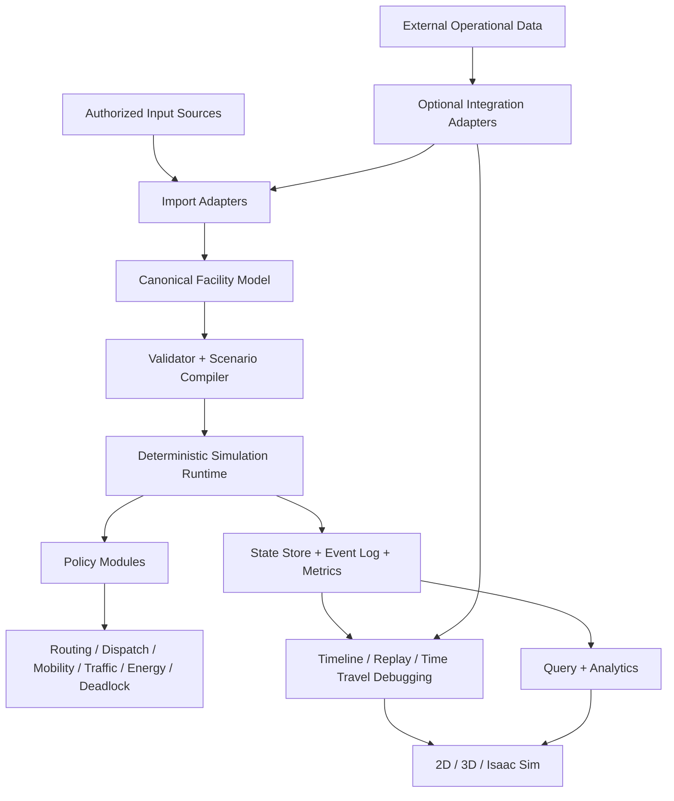

# Sim_Core Simulator Architecture v2

| 항목 | 값 |
|---|---|
| 상태 | Legacy 참고 시스템 분석을 기능 요구사항으로만 반영한 기준선 |
| 버전 | 0.2.1 |
| 작성일 | 2026-07-18 |
| 대상 | FAB OHT 차세대 독립 이산사건 시뮬레이터 |
| 이전 기준 | `SIM_CORE_ARCHITECTURE_V1.md` |

## 1. 변경 결론

Architecture v2는 Job_Tasks의 OHT 메인 에뮬레이터, OCS, OCS Replay 프로그램을 Sim_Core의 구조로 복제하거나 계승하지 않습니다.

해당 프로그램들은 오래된 운영·검증 도구의 참고 사례로만 사용하며, 분석 목적은 다음과 같습니다.

1. 실제 OHT 운영에서 반드시 필요한 기능을 식별합니다.
2. 기존 프로그램이 해결했던 문제를 추출합니다.
3. 해당 문제를 현대적인 Sim_Core 아키텍처에서 더 일반적이고 확장 가능한 방식으로 해결합니다.
4. Legacy 프로그램의 프로세스 경계, 클래스 구조, 통신 방식, 실행 모델을 Sim_Core의 필수 구조로 가져오지 않습니다.

Architecture v1의 다음 핵심 원칙은 그대로 유지합니다.

- `Canonical Facility Model`
- 결정론적 `Discrete Event Simulation Kernel`
- 교체 가능한 routing / dispatch / mobility / traffic policy
- Headless-first 실행 구조
- 2D/3D/Isaac Sim과 simulation authority 분리
- explainable event trace와 deterministic rerun

v2의 변경은 Legacy 프로그램 분석에서 발견한 유용한 요구사항을 **범용 기능으로 재설계**하는 데 한정합니다.

## 2. Legacy 참고 시스템의 위치

Job_Tasks의 OHT 메인 에뮬레이터, OCS, OCS Replay는 다음과 같이 취급합니다.

| 참고 대상 | 직접 반영하지 않는 것 | Sim_Core에 추출할 수 있는 요구사항 |
|---|---|---|
| OHT 메인 에뮬레이터 | 실행 구조, 프로세스 분할, 내부 클래스 구조 복제 | 차량 상태 표현, 이동 진행률, 작업 단계, 정지·도착·적재 상태 |
| OCS | OCS 제품 구조와 제어 흐름 복제 | Job lifecycle, routing, dispatch, traffic policy가 독립적으로 교체 가능해야 함 |
| OCS Replay | 전용 Replay 프로그램 구조 복제 | 시간축 탐색, 실행 기록 재생, 상태 복원, 장애·교착 원인 분석 |

즉 Legacy 시스템은 **Reference System**이며 **Target Architecture**가 아닙니다.

## 3. 현대적 Sim_Core 목표 구조



핵심은 `OCS`, `Emulator`, `Replay`라는 기존 프로그램 구분이 아니라 다음 네 가지 능력입니다.

1. **Modeling**: 다양한 입력을 하나의 Canonical Model로 정규화
2. **Simulation**: 결정론적이고 고성능인 event-driven simulation
3. **Policy Experimentation**: routing, dispatch, traffic 정책을 독립 교체
4. **Observability & Analysis**: 모든 결과를 재현·탐색·비교·설명

## 4. Simulation Runtime의 책임

Simulation Runtime은 Sim_Core의 authoritative execution engine입니다.

책임:

- simulation time 진행
- event ordering
- 차량 및 Job 상태 전이
- resource reservation
- movement scheduling
- routing / dispatch / traffic policy 호출
- metric 생성
- event trace 기록

Runtime 내부의 authoritative mutation은 기존 v1과 동일하게 single-writer 원칙을 유지합니다.

외부 시스템이나 Viewer는 Runtime 상태를 직접 변경하지 않습니다.

## 5. Vehicle State 모델 보강

Legacy 에뮬레이터 분석에서 유용한 부분은 별도 Emulator 프로그램 구조가 아니라 **차량 상태 표현이 충분히 풍부해야 한다는 요구사항**입니다.

따라서 `VehicleRuntimeState`는 fidelity 수준에 따라 다음 정보를 표현할 수 있어야 합니다.

```text
VehicleRuntimeState
  vehicle_id
  state_version
  operational_state
  current_job_id
  job_phase

  current_node
  current_edge
  edge_progress

  position_xyz
  heading
  velocity
  acceleration

  load_state
  occupied_resources[]
  reserved_resources[]
  blocked_reason
```

F0/F1에서는 연속 위치와 가감속 값이 비어 있을 수 있습니다.

F2/F3 이상에서는 edge progression, position, velocity, acceleration을 사용합니다.

중요한 원칙은 모든 fidelity가 같은 Logical Vehicle State 계약을 공유하고, 필요한 필드의 유효성만 profile별로 달라지는 것입니다.

## 6. Policy Architecture 유지 및 강화

기존 OCS 프로그램이 제공했던 기능을 OCS라는 별도 상위 계층으로 복제하지 않습니다.

대신 다음 기능을 독립 Policy Module로 유지합니다.

- `DemandPolicy`
- `RoutingPolicy`
- `DispatchPolicy`
- `MobilityPolicy`
- `TrafficControlPolicy`
- `ParkingPolicy`
- `ChargingPolicy`
- `DeadlockDetectionPolicy`
- 향후 `DeadlockRecoveryPolicy`

각 Policy는 version과 parameter hash를 가집니다.

같은 Model/Scenario에서 Policy만 교체하여 실험할 수 있어야 합니다.

Policy는 Runtime의 내부 상태를 임의로 직접 수정하지 않고 명시된 command 또는 domain operation을 통해 상태 변경을 요청합니다.

이 구조를 통해 실제 OCS 로직을 흉내내는 대신 더 다양한 알고리즘을 실험할 수 있습니다.

## 7. Replay를 현대적 분석 기능으로 재정의

Legacy OCS Replay의 프로그램 구조는 복제하지 않습니다.

Sim_Core의 Replay는 독립 실행 프로그램을 모방하는 것이 아니라 **Observability Platform의 일부**로 설계합니다.

### 7.1 Event Timeline

모든 실행은 시간 순서가 완전히 결정된 event stream을 남깁니다.

```text
TimelineEvent
  event_id
  simulation_time_us
  sequence
  event_type
  entity_id
  cause_event_id
  correlation_id
  payload_version
  payload
```

Timeline은 Viewer용 부가 로그가 아니라 실행 설명 가능성의 기준 자료입니다.

### 7.2 Trace Replay

저장된 event와 state transition을 이용해 simulation logic을 다시 실행하지 않고 과거 실행을 재생합니다.

용도:

- 실행 시각화
- 특정 시점 차량 위치와 상태 확인
- 교착 직전 상태 분석
- 배차 결정 과정 추적
- Viewer 회귀 검증

### 7.3 Time Travel Debugging

Snapshot과 event offset을 결합해 임의 시점의 상태를 복원할 수 있는 구조를 목표로 합니다.

```text
Snapshot(t0) + Events(t0 ... tn) -> State(tn)
```

초기 구현에서는 전체 event replay를 사용하고, 성능 요구가 확인되면 주기적 snapshot을 추가합니다.

### 7.4 Deterministic Rerun

다음 입력이 동일하면 동일 event hash를 생성해야 합니다.

- model revision
- scenario
- seed
- policy versions
- engine version

Trace Replay와 Deterministic Rerun은 목적이 다릅니다.

- Replay: 이미 발생한 실행을 관찰
- Rerun: 같은 조건에서 엔진 결과의 결정론 검증

### 7.5 Run Comparison

두 실행의 차이를 단순 최종 KPI뿐 아니라 timeline 수준에서도 비교할 수 있어야 합니다.

비교 대상:

- first divergent event
- first divergent state transition
- dispatch decision 차이
- route decision 차이
- congestion 발생 시점
- deadlock cycle 차이
- throughput / latency / utilization 차이

이는 구형 Replay 프로그램보다 더 강력한 정책 실험과 회귀 분석 기능을 목표로 합니다.

## 8. External Identity Mapping

Legacy 시스템의 Node ID를 그대로 중심 모델로 사용하지 않습니다.

다만 외부 레이아웃, 운영 데이터, 로그를 가져올 때 source ID와 Canonical ID의 관계를 추적할 필요가 있습니다.

따라서 범용 provenance 기능으로 다음 개념을 둡니다.

```text
SourceIdentity
  source_namespace
  source_artifact
  source_entity_type
  source_id
  canonical_entity_id
  model_revision_id
```

이 기능의 목적은 OCS 호환이 아니라 다음입니다.

- 다양한 importer의 source 추적
- 원본 데이터와 결과 간 lineage 유지
- 외부 로그 또는 운영 데이터 정합성 검증
- revision 간 ID 충돌 방지

Runtime 내부 numeric handle은 성능 최적화용이며 영구 식별자로 노출하지 않습니다.

## 9. 운영 데이터 기반 Scenario Reconstruction

Legacy Replay 분석에서 얻을 수 있는 가장 유용한 확장 기능 중 하나는 실제 또는 권한이 확인된 운영 기록을 simulation input으로 재구성하는 기능입니다.

이를 `Scenario Reconstruction`으로 정의합니다.

```text
Authorized Operational Records
 -> Source Adapter
 -> Identity Resolution
 -> Timeline Normalization
 -> Scenario Reconstruction
 -> Validation
 -> Simulation / Analysis
```

가능한 활용:

- 실제 수요 패턴 재현
- 특정 장애 시간대 재현
- 차량 초기 배치 복원
- 정책 변경 전후 비교
- 실제 운영과 simulation 결과의 calibration

이 기능은 특정 OCS 로그 포맷에 종속되지 않습니다.

각 외부 포맷은 Adapter로 제한합니다.

## 10. Integration Adapter 원칙

향후 실제 OCS, MES, MCS, DB 또는 기타 외부 시스템과 연결할 수 있지만 Core architecture에는 특정 외부 제품을 전제로 하지 않습니다.

```text
External System
     |
     v
Integration Adapter
     |
     v
Versioned Sim_Core Contract
```

초기 원칙:

- read-only 또는 offline import 우선
- Core는 외부 프로토콜을 모름
- credential은 Core model에 저장하지 않음
- 외부 데이터 오류는 validator에서 진단
- live control은 별도의 제품화 단계에서 검토

## 11. 고성능 설계 방향

현대적이고 성능이 우수한 시뮬레이터를 목표로 다음 원칙을 유지합니다.

### 11.1 Headless-first

GUI와 3D가 없어도 최대 성능으로 simulation을 실행할 수 있어야 합니다.

### 11.2 Event-driven execution

고정 timestep 전체 차량 업데이트보다 event-driven DES를 기본으로 사용합니다.

고충실도 이동에서만 필요한 범위에 제한적으로 세분화된 update를 적용합니다.

### 11.3 Immutable topology

Compile 완료 후 network topology는 기본적으로 immutable하게 유지하여 cache와 병렬 read를 쉽게 합니다.

### 11.4 Integer simulation time

`int64 microsecond tick`을 유지해 부동소수점 시간 누적 오차와 event ordering 불확실성을 줄입니다.

### 11.5 Deterministic single-writer

상태 commit은 single-writer event loop가 담당합니다.

다음 작업만 병렬화 후보입니다.

- route precomputation
- immutable graph analysis
- batch validation
- result compression
- analytics aggregation

병렬 결과는 canonical ordering으로 merge합니다.

### 11.6 Data-oriented optimization

구현이 진행되면 대규모 vehicle/resource 상태는 cache locality를 고려한 contiguous storage와 stable handle 구조를 검토합니다.

객체지향 계층을 과도하게 깊게 만들지 않습니다.

성능 최적화는 benchmark와 profiler 결과를 근거로 수행합니다.

## 12. 권장 Package 구조

```text
Sim_Core/
├── apps/                    # CLI 및 향후 서비스 진입점
├── bindings/                # Python / Isaac Sim 연동
├── include/sim_core/        # 공개 C++ API
├── schemas/                 # facility, scenario, event, result schema
├── src/
│   ├── application/         # use case와 run orchestration
│   ├── domain/              # OHT, Job, Network, Resource
│   ├── kernel/              # time, event queue, scheduler, RNG
│   ├── modules/             # routing, dispatch, mobility, traffic, energy, deadlock
│   ├── observability/       # event trace, timeline, snapshot, comparison
│   ├── ports/               # importer, store, observer, integration interface
│   └── adapters/            # file/database/external format adapters
└── tests/                   # unit, contract, golden, regression, performance
```

`control/`, `execution/`, `replay/`을 Legacy 프로그램 이름과 역할에 맞춰 강제 분리하지 않습니다.

기능적 응집도와 실제 구현 복잡도를 기준으로 필요한 모듈만 생성합니다.

## 13. CLI Use Case

```text
sim-core import      --input <authorized-source> --output <model-revision>
sim-core validate    --model <model-revision>
sim-core compile     --model <model-revision> --scenario <scenario>
sim-core run         --compiled <run-plan> --results <directory>
sim-core replay      --results <directory>
sim-core reconstruct --input <authorized-operational-data> --output <scenario>
sim-core rerun       --manifest <run-manifest>
sim-core compare     --baseline <run-a> --candidate <run-b>
```

실제 command와 option 이름은 구현 단계에서 확정합니다.

## 14. 1차 구현 Vertical Slice 수정

첫 구현은 Legacy 연동이 아니라 Sim_Core 자체 simulation capability 검증에 집중합니다.

1. CMake/C++20 project skeleton
2. `SimulationTime`, `EventEnvelope`, deterministic priority queue
3. Canonical JSON schema의 Node / Edge / Station 최소 집합
4. structural / graph validator
5. F0 movement와 Dijkstra routing
6. Vehicle / Job 상태기계
7. deterministic dispatch
8. JSONL event trace와 run manifest
9. trace replay 최소 구현
10. 단일 직선 network golden test

완료 조건:

- 차량 1대와 Job 1건이 정상 완료됩니다.
- 동일 scenario 반복 실행의 event hash가 같습니다.
- Replay에서 동일 상태 전이 순서를 재구성할 수 있습니다.
- 도달 불가능한 station은 실행 전에 차단됩니다.
- UI, Isaac Sim, OCS, Legacy Emulator 없이 모든 core test가 실행됩니다.

## 15. Roadmap

| 단계 | 산출물 | 종료 조건 |
|---|---|---|
| A0 Governance | 사용 가능 자료와 금지 자료 구분 | 개발 fixture 승인 |
| A1 Foundation | schema, validator, deterministic kernel | synthetic golden test 통과 |
| A2 OHT MVP | F0/F1 이동, routing, dispatch, metrics | 정상 축소 scenario 완주 |
| A3 Observability | event timeline, replay, compare | 실행 원인과 차이를 추적 가능 |
| A4 Traffic | F2/F3, zone/node reservation | 혼잡과 대기 원인 설명 |
| A5 Diagnostics | wait-for graph, deadlock detect-only | cycle 구성 entity 보고 |
| A6 Energy | SOC, charger, charging policy | 충전 혼잡 민감도 분석 |
| A7 Scenario Reconstruction | 운영 기록 기반 scenario 생성 | 승인된 기록의 재현 가능 |
| A8 Productization | API, 2D, Isaac Sim projection | headless 결과와 화면 일치 |
| A9 Performance | benchmark 기반 최적화 | 목표 workload 성능 기준 충족 |

## 16. 확정 원칙

- Sim_Core는 특정 OCS, Emulator, Replay 프로그램을 복제하지 않습니다.
- Legacy 프로그램은 기능 요구사항과 실패 사례를 찾기 위한 참고 자료입니다.
- 시스템 중심은 Canonical Model과 Deterministic DES Runtime입니다.
- routing, dispatch, traffic은 독립 Policy Module입니다.
- Replay는 특정 OCS 기능이 아니라 범용 Observability 기능입니다.
- 외부 ID 매핑은 특정 OCS 호환 계층이 아니라 source provenance 기능입니다.
- 외부 운영 데이터는 Adapter와 Scenario Reconstruction을 통해 선택적으로 사용합니다.
- UI와 Isaac Sim은 simulation authority를 가지지 않습니다.
- 고성능 최적화는 benchmark와 profiler를 근거로 진행합니다.
- 권한이 불명확한 코드, 바이너리, UI 자산은 제품 코드에 포함하지 않습니다.

## 17. 구현 전에 수치 확정이 필요한 항목

- canonical 좌표계와 geometry tolerance
- microsecond 변환 rounding policy
- event priority registry
- vehicle kinematic parameter와 safety distance
- dispatch score 초기 항과 가중치
- SOC 소비 및 충전 curve
- snapshot interval 정책
- benchmark workload와 성능 목표
- importer별 사용 권한과 fixture 범위

이 값들은 Legacy 프로그램의 상수나 동작을 그대로 복사하지 않습니다.

검증 가능한 요구사항과 독립적인 benchmark를 기준으로 결정하고 policy 또는 scenario version에 명시합니다.
