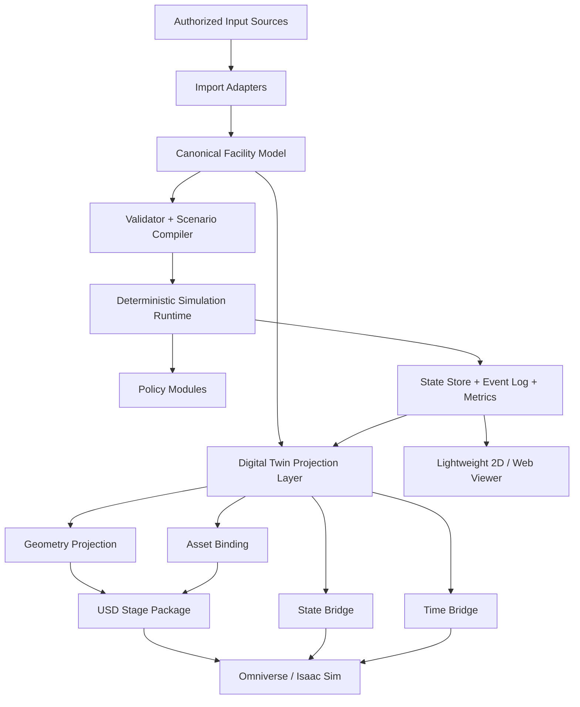

# Sim_Core Simulator Architecture v3

| 항목 | 값 |
|---|---|
| 상태 | Headless-first와 One-click Digital Twin 전환을 핵심 원칙으로 반영한 기준선 |
| 버전 | 0.3.0 |
| 작성일 | 2026-07-18 |
| 대상 | FAB OHT 차세대 독립 시뮬레이터 및 Digital Twin 플랫폼 |
| 이전 기준 | `SIM_CORE_ARCHITECTURE_V2.md` |

## 1. 변경 결론

Sim_Core는 당장 고가 GPU나 Omniverse/Isaac Sim 환경이 없어도 완전한 모델링, 정책 실험, 대규모 시뮬레이션, 분석을 수행할 수 있어야 합니다.

동시에 GPU와 고성능 HW 접근성이 확보되는 순간 동일 모델과 동일 실행 결과를 별도의 재모델링 없이 Omniverse/Isaac Sim 기반 Digital Twin으로 전환할 수 있어야 합니다.

따라서 v3의 최우선 설계 원칙은 다음입니다.

> **Simulation Truth와 Digital Twin Presentation을 분리하되, 둘 사이의 변환 경계를 처음부터 1급 아키텍처 요소로 설계한다.**

Sim_Core의 Canonical Model과 Runtime State는 특정 3D 엔진에 종속되지 않습니다. 대신 Canonical Model이 충분한 geometry, topology, semantics, identity, asset binding 정보를 보유하고, Digital Twin Projection 계층이 이를 USD/Omniverse/Isaac Sim 표현으로 손실 없이 투영합니다.

목표 사용자 경험은 다음과 같습니다.

```text
Headless Simulation Model
        |
        |  동일 model revision + asset profile
        v
[ Enable Digital Twin ]
        |
        v
USD / Omniverse / Isaac Sim Scene 생성
        |
        v
Runtime State Stream 연결
        |
        v
동일 차량·Job·이벤트를 3D Digital Twin으로 재생 또는 동기 실행
```

즉 "Isaac Sim용 모델을 다시 만든다"가 아니라 "Sim_Core 모델을 Isaac Sim Projection으로 바꾼다"가 되어야 합니다.

## 2. 핵심 구조



핵심은 `Digital Twin Projection Layer`가 Viewer 부가기능이 아니라 Canonical Model과 동등하게 장기 호환성을 보장해야 하는 공식 경계라는 점입니다.

## 3. HW 접근성 독립 원칙

### 3.1 최소 HW에서도 Core 기능 완전 사용

GPU가 없는 개발 PC 또는 일반 CPU 서버에서도 다음 기능은 모두 동작해야 합니다.

- model import 및 validation
- scenario compile
- deterministic DES 실행
- routing / dispatch / traffic / energy 정책 실험
- KPI / analytics
- event timeline
- trace replay
- run comparison
- scenario reconstruction

3D 엔진 설치 여부가 Core 기능의 선행 조건이 되어서는 안 됩니다.

### 3.2 고성능 HW는 선택적 가속 및 표현 계층

GPU 서버 또는 Cloud GPU가 사용 가능할 때 다음 기능을 추가 활성화합니다.

- 고해상도 USD Scene 생성
- Isaac Sim/Omniverse 3D visualization
- RTX rendering
- sensor simulation
- robot/vehicle physics fidelity 향상
- 대규모 3D scene streaming
- synthetic data generation

Core Simulation Runtime의 의미론과 정책 결과는 GPU 존재 여부에 따라 달라져서는 안 됩니다.

### 3.3 Cloud-ready

Digital Twin 실행 대상은 로컬 GPU에 한정하지 않습니다.

```text
Local CPU
  -> Headless Simulation

Cloud CPU
  -> Large-scale batch simulation

Cloud GPU
  -> Omniverse / Isaac Sim projection
  -> High-fidelity digital twin
```

Cloud provider와 instance type은 Adapter/Deployment 계층 문제이며 Domain과 Kernel에 노출하지 않습니다.

## 4. Canonical Facility Model의 Digital Twin 준비성

Canonical Facility Model은 단순 graph만 저장해서는 안 됩니다.

향후 Digital Twin 투영을 위해 다음 정보를 1급 데이터로 보존합니다.

```text
FacilityModelRevision
  topology
  geometry
  semantics
  coordinate_system
  units
  hierarchy
  source_identity
  visual_binding_hints
  physical_binding_hints
```

### 4.1 Geometry

Node/Edge뿐 아니라 다음 정보를 표현할 수 있어야 합니다.

- polyline / spline / arc
- elevation
- banking / slope
- orientation frame
- path width / clearance
- station pose
- equipment footprint
- zone volume

초기 fidelity에서는 일부 값이 비어 있을 수 있지만 schema는 확장 가능해야 합니다.

### 4.2 Coordinate Contract

Canonical coordinate system과 Digital Twin coordinate system 사이 변환을 명시적으로 관리합니다.

```text
CoordinateTransform
  source_frame
  canonical_frame
  target_frame
  axis_mapping
  handedness
  unit_scale
  origin_offset
  rotation
```

USD/Isaac Sim 전환 시 좌표 변환을 개별 스크립트에서 임의 처리하지 않습니다.

모든 변환은 versioned Coordinate Profile을 사용합니다.

### 4.3 Semantic Tags

3D asset name에 의미를 숨기지 않습니다.

Canonical entity는 semantic role을 가집니다.

예:

- `rail`
- `station`
- `vehicle`
- `charger`
- `buffer`
- `zone`
- `sensor`
- `equipment`

Digital Twin Adapter는 semantic tag를 기준으로 asset과 behavior를 선택합니다.

## 5. Asset Binding Architecture

One-click Digital Twin 전환의 핵심은 "geometry 변환"보다 "asset binding"입니다.

Canonical entity와 실제 3D asset 사이를 다음 계약으로 분리합니다.

```text
AssetBindingProfile
  profile_id
  profile_version
  target_platform
  bindings[]

AssetBinding
  semantic_type
  selector
  asset_uri
  variant
  scale_policy
  orientation_policy
  material_profile
  physics_profile
  fallback_asset
```

예:

```text
semantic_type: station
selector: station_type == "LOAD_PORT"
asset_uri: assets/stations/load_port_A.usd
```

이렇게 하면 동일 Facility Model을 다음과 같이 여러 표현으로 변환할 수 있습니다.

- lightweight debug geometry
- engineering visualization
- presentation quality model
- Isaac Sim physics model

Model 자체에는 특정 USD 파일 경로를 강하게 박아 넣지 않습니다.

AssetBindingProfile 교체만으로 표현 품질을 바꿀 수 있어야 합니다.

## 6. Digital Twin Projection Layer

Digital Twin Projection은 다음 네 구성요소로 분리합니다.

### 6.1 Geometry Projector

Canonical Facility Model을 target scene graph로 변환합니다.

초기 target:

- USD

향후 확장 가능 target:

- glTF
- WebGPU용 scene format
- 기타 Digital Twin 플랫폼

Geometry Projector는 topology 의미를 변경하지 않습니다.

### 6.2 Asset Resolver

Canonical semantic entity와 AssetBindingProfile을 이용해 실제 asset을 resolve합니다.

Asset이 없을 경우 반드시 fallback primitive를 생성해 Scene 생성 자체가 실패하지 않게 합니다.

즉 고급 asset 준비 여부가 Digital Twin 전환의 blocker가 되어서는 안 됩니다.

### 6.3 State Bridge

Simulation Runtime의 상태를 Digital Twin Scene에 전달합니다.

```text
EntityStateFrame
  simulation_time_us
  entity_id
  state_version
  pose
  velocity
  operational_state
  load_state
  job_phase
```

Viewer나 Isaac Sim은 이 상태를 소비합니다.

Digital Twin 플랫폼이 Runtime의 authoritative state를 직접 수정하지 않는 것이 기본 원칙입니다.

### 6.4 Time Bridge

Simulation time과 wall clock / render frame을 분리합니다.

지원 모드:

- `FAST_AS_POSSIBLE`
- `REALTIME`
- `SCALED_REALTIME`
- `STEP`
- `REPLAY`

Isaac Sim rendering 속도가 느려져도 DES event ordering은 변하지 않습니다.

## 7. One-click 전환 목표

최종 UX는 사용자가 내부 변환 절차를 알 필요가 없도록 설계합니다.

CLI 개념:

```text
sim-core twin export \
  --model <model-revision> \
  --asset-profile <profile> \
  --target isaac-sim \
  --output <scene-package>
```

향후 GUI:

```text
[ Open in Digital Twin ]
```

내부 동작:

```text
1. Model revision 검증
2. Coordinate Profile 선택
3. Asset Binding Profile resolve
4. USD Stage 생성
5. entity <-> prim mapping 생성
6. runtime state bridge 설정
7. target application launch
8. scene load
9. state synchronization 시작
```

사용자는 개별 Node, Station, Rail, Vehicle을 다시 배치하지 않습니다.

## 8. USD/Omniverse/Isaac Sim 패키징 원칙

Digital Twin output은 단일 거대한 파일에 모든 내용을 bake하지 않습니다.

권장 구조:

```text
DigitalTwinPackage/
├── manifest.json
├── facility.usda
├── topology.usda
├── stations.usda
├── vehicles.usda
├── assets/
├── bindings/
│   └── entity_prim_map.json
└── runtime/
    └── state_contract.json
```

Scene composition은 reference/payload/layer 개념을 활용할 수 있도록 설계합니다.

Canonical Model revision과 USD package revision 관계를 manifest에 기록합니다.

```text
DigitalTwinManifest
  model_revision_id
  model_content_hash
  projection_version
  coordinate_profile_version
  asset_binding_profile_version
  target_platform
  generated_at
```

이 정보로 "현재 3D Scene이 어떤 Simulation Model에서 생성됐는지"를 항상 역추적할 수 있어야 합니다.

## 9. Entity-to-Prim Identity Mapping

Simulation Entity ID와 USD Prim Path 사이 매핑을 별도 관리합니다.

```text
EntityPrimMap
  canonical_entity_id
  prim_path
  asset_binding_id
  projection_revision
```

예:

```text
vehicle:V-001 -> /World/Vehicles/V_001
station:S-204 -> /World/Stations/S_204
```

Prim Path를 Domain ID로 직접 사용하지 않습니다.

이를 통해 USD hierarchy가 변경돼도 Simulation Model ID는 안정적으로 유지됩니다.

## 10. Runtime Digital Twin 모드

### 10.1 Offline Projection

Simulation 완료 후 결과를 3D로 재생합니다.

장점:

- 가장 낮은 GPU 요구량
- batch simulation과 완전 분리
- 분석 및 발표에 적합

### 10.2 Live Visualization

Headless Runtime 실행 중 상태 stream을 Isaac Sim으로 전달합니다.

Runtime이 authoritative합니다.

### 10.3 Co-simulation

향후 필요 시 특정 physics 결과만 외부 simulation engine에서 받아올 수 있습니다.

단 기본 아키텍처에서는 이를 선택적 plugin으로 둡니다.

```text
DES Runtime
  -> CoSimulation Port
  -> Physics Adapter
  -> External Physics Engine
```

Co-simulation이 없어도 시스템 전체가 동작해야 합니다.

### 10.4 Digital Twin Replay

저장된 TimelineEvent와 State Snapshot으로 Isaac Sim scene을 재생합니다.

이를 통해 Cloud GPU를 simulation 실행 시점이 아니라 분석 시점에만 임대할 수 있습니다.

이 방식은 HW 접근성이 낮은 환경에서 특히 중요합니다.

## 11. 성능 전략

Digital Twin 기능이 Core 성능을 훼손하지 않도록 다음을 강제합니다.

- Core Runtime은 render frame을 기다리지 않음
- state stream은 bounded queue 사용
- 필요 시 frame coalescing 허용
- visualization subscriber가 느려도 Runtime 진행 유지
- full event stream과 visualization state stream 분리
- 3D용 상태는 필요 주기로 downsample 가능
- entity state는 batch/SoA 전송 구조 검토

즉 event 100만 건을 모두 render update 100만 번으로 변환하지 않습니다.

Simulation 정확도와 Visualization update rate를 분리합니다.

## 12. Fidelity Independence

Simulation Fidelity와 Visualization Fidelity를 분리합니다.

예:

```text
Simulation F1 + Visualization V3
Simulation F3 + Visualization V1
```

가능해야 합니다.

- Simulation Fidelity: 이동/자원/가감속/교통 모델 정밀도
- Visualization Fidelity: mesh/material/lighting/animation 정밀도

고품질 3D를 사용한다고 Simulation 결과가 자동으로 더 정확한 것은 아닙니다.

반대로 단순 2D 화면에서도 고충실도 Simulation은 가능해야 합니다.

## 13. Deployment Profiles

### Profile A - Developer Laptop

- CPU only
- Headless Core
- lightweight 2D
- JSON/JSONL result

### Profile B - Batch Simulation Server

- multi-core CPU
- 대규모 scenario sweep
- no 3D

### Profile C - Cloud GPU Digital Twin

- simulation result 또는 live state stream 입력
- USD scene
- Omniverse/Isaac Sim
- high fidelity visualization

### Profile D - Full Co-simulation

- DES + selected physics integration
- sensor/robotics simulation

모든 Profile은 같은 Canonical Model revision을 사용합니다.

## 14. Package 구조 수정

```text
Sim_Core/
├── apps/
├── bindings/
├── include/sim_core/
├── schemas/
│   ├── facility/
│   ├── scenario/
│   ├── runtime/
│   ├── observability/
│   └── digital_twin/
├── src/
│   ├── application/
│   ├── domain/
│   ├── kernel/
│   ├── modules/
│   ├── observability/
│   ├── digital_twin/
│   │   ├── projection/
│   │   ├── asset_binding/
│   │   ├── state_bridge/
│   │   └── time_bridge/
│   ├── ports/
│   └── adapters/
│       └── digital_twin/
│           ├── usd/
│           └── isaac_sim/
└── tests/
```

`digital_twin/`은 Domain이나 Kernel의 하위가 아니라 별도 outward-facing 계층입니다.

## 15. 테스트 전략 추가

Digital Twin 전환 가능성은 나중에 수동 검증하지 않고 초기부터 contract test로 보호합니다.

필수 테스트:

1. Canonical model -> USD projection 성공
2. 모든 Canonical entity의 EntityPrimMap 생성
3. Coordinate transform round-trip 허용 오차 검증
4. 동일 model revision의 projection manifest 재현성 검증
5. asset이 없어도 fallback primitive로 scene 생성
6. Runtime State ID와 Prim ID 매핑 일치
7. Replay state와 live state projection 결과 일치
8. Visualization subscriber 중단 시 Runtime 영향 없음
9. 2D/3D viewer가 동일 logical state를 표시
10. Digital Twin adapter 없이 Core 전체 test 통과

## 16. Roadmap 수정

| 단계 | 산출물 | 종료 조건 |
|---|---|---|
| A0 Governance | 사용 가능 자료와 금지 자료 구분 | 개발 fixture 승인 |
| A1 Foundation | schema, validator, deterministic kernel | synthetic golden test 통과 |
| A2 OHT MVP | F0/F1 이동, routing, dispatch, metrics | 정상 축소 scenario 완주 |
| A3 Digital Twin Contract | coordinate, semantic, asset binding, entity mapping schema | 엔진 독립 projection contract 확정 |
| A4 Observability | event timeline, replay, compare | 실행 원인과 차이 추적 가능 |
| A5 USD Projection MVP | Canonical model -> USD + fallback assets | 클릭 수준의 scene 생성 가능 |
| A6 Traffic | F2/F3, zone/node reservation | 혼잡과 대기 원인 설명 |
| A7 Isaac Sim Adapter | USD package load + state bridge + time bridge | 동일 run을 Isaac Sim에서 재생 가능 |
| A8 Diagnostics | deadlock, wait-for graph | 교착 원인 설명 |
| A9 Energy | SOC, charger | 충전 정책 실험 가능 |
| A10 Scenario Reconstruction | 운영 기록 기반 scenario 생성 | 실제 기록 재현 가능 |
| A11 Cloud Digital Twin | Cloud GPU deployment profile | Core 결과를 원격 Digital Twin으로 실행 |
| A12 Performance | benchmark 기반 최적화 | 목표 workload 충족 |

중요한 점은 Isaac Sim 연동을 가장 마지막 Productization 단계에서 처음 고려하지 않는다는 것입니다.

**실제 Isaac Sim Adapter 구현은 뒤에 하더라도, Canonical Model과 State Contract는 A3부터 Digital Twin-ready여야 합니다.**

## 17. One-click 전환 완료 조건

다음 조건을 만족하면 Digital Twin 전환 구조가 완성된 것으로 봅니다.

- 기존 model을 수동 재모델링하지 않음
- topology를 다시 입력하지 않음
- station/vehicle ID를 다시 매핑하지 않음
- 좌표계 변환을 사용자 스크립트로 처리하지 않음
- asset profile만 선택하면 scene 생성 가능
- asset이 없어도 fallback scene 생성 가능
- 동일 runtime result를 2D와 Isaac Sim에서 모두 재생 가능
- Cloud GPU 환경에서도 동일 package 사용 가능
- target adapter를 교체해도 Domain/Kernel 수정 없음

## 18. 확정 원칙

- Headless Simulation Runtime이 authoritative source입니다.
- Digital Twin은 Core에 종속되는 소비자이지만, 변환 계약은 아키텍처 핵심 요소입니다.
- Canonical Model은 graph뿐 아니라 Digital Twin 투영에 필요한 geometry/semantic/coordinate metadata를 보존합니다.
- Simulation Fidelity와 Visualization Fidelity를 분리합니다.
- USD/Isaac Sim은 Adapter이며 Domain과 Kernel은 이를 모릅니다.
- 3D asset은 AssetBindingProfile로 분리합니다.
- Entity ID와 USD Prim Path는 직접 결합하지 않습니다.
- Simulation time과 render/wall clock을 분리합니다.
- GPU가 없어도 Core 기능은 완전 동작합니다.
- Cloud GPU는 필요 시 Digital Twin 기능을 활성화하는 선택적 실행 자원입니다.
- Digital Twin adapter 없이도 모든 Core test가 통과해야 합니다.
- HW 접근성이 확보되었을 때 재설계 없이 고충실도 Digital Twin으로 확장 가능해야 합니다.

## 19. 다음 구현 우선순위

Architecture v3 이후 구현 시 Digital Twin-ready 기반을 너무 늦게 미루지 않습니다.

1. Canonical coordinate contract
2. semantic type registry
3. geometry schema 확장
4. AssetBindingProfile schema
5. EntityPrimMap contract
6. projection manifest
7. 최소 USD projector
8. fallback primitive asset set
9. state stream contract
10. lightweight viewer와 Isaac Sim adapter가 동일 state contract를 소비하도록 설계

이 순서를 따르면 초기에는 저사양 환경에서 빠른 Headless Simulation을 개발하면서도, 향후 GPU와 Cloud HW 접근성이 좋아졌을 때 별도의 모델 재구축 없이 동일 Sim_Core 자산을 고성능 Digital Twin으로 전환할 수 있습니다.
