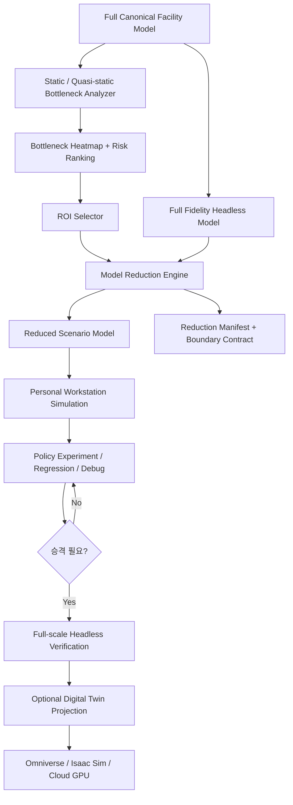

# Sim_Core Simulator Architecture v4

| 항목 | 값 |
|---|---|
| 상태 | Multi-Scale Simulation과 Bottleneck-driven Model Reduction을 핵심 원칙으로 반영한 기준선 |
| 버전 | 0.4.0 |
| 작성일 | 2026-07-18 |
| 대상 | FAB OHT 차세대 독립 시뮬레이터 및 Digital Twin 플랫폼 |
| 이전 기준 | `SIM_CORE_ARCHITECTURE_V3.md` |

## 1. 변경 결론

Architecture v4는 v3의 Headless-first, One-click Digital Twin Projection 원칙을 유지하면서, 대규모 FAB 모델을 개인 워크스테이션에서도 검증할 수 있도록 **Bottleneck-driven Multi-Scale Simulation**을 추가합니다.

핵심 목표는 다음입니다.

1. 전체 FAB 모델을 애니메이션 없이 빠르게 정적/준정적으로 분석해 병목 후보를 표시합니다.
2. 병목 후보를 Region of Interest(ROI)로 선택합니다.
3. ROI 내부는 높은 충실도로 유지합니다.
4. ROI 외부는 단순 삭제하지 않고, ROI에 가하는 부하와 흐름을 보존하는 등가 모델로 축약합니다.
5. 전체 3000대급 모델을 예를 들어 300대급 축소 모델로 변환해 개인 워크스테이션에서 반복 실험할 수 있게 합니다.
6. 축소 모델 결과는 항상 원본 모델 revision과 Reduction Manifest를 통해 역추적할 수 있어야 합니다.
7. 축소 모델에서 확인된 정책이나 병목 개선안은 필요 시 전체 Headless 모델 또는 Cloud GPU Digital Twin으로 승격 검증할 수 있어야 합니다.

이 기능은 특정 Legacy 분석 도구를 복제하지 않습니다. SemiLA와 유사한 **애니메이션 없는 병목 표시 경험**에서 얻을 수 있는 요구사항만 일반화하여 Sim_Core 고유의 분석·축소·검증 파이프라인으로 구현합니다.

## 2. Big Picture



핵심 원칙은 다음입니다.

> **전체 모델은 Simulation Truth이고, 축소 모델은 특정 질문에 답하기 위한 검증용 Projection이다.**

축소 모델이 원본 모델을 대체하지 않습니다.

## 3. Bottleneck Intelligence Layer

### 3.1 목적

대규모 모델을 무조건 3D로 실행하거나 모든 차량을 동적 시뮬레이션하기 전에, Canonical Model과 Scenario 정보를 기반으로 병목 가능성을 빠르게 추정합니다.

이 계층은 애니메이션이 없어도 다음을 표시할 수 있어야 합니다.

- 혼잡 예상 Edge / Node / Merge / Junction
- Station 접근 집중도
- Zone/HID/FlowControl 용량 부족 후보
- 차량 밀집 예상 구간
- Job demand 집중 구간
- Shortest-path betweenness 또는 경로 집중도
- 예상 queue pressure
- 예상 blocking propagation 위험
- Parking / Charger 부족 후보
- Deadlock-prone topology
- 특정 정책 변경에 민감한 구역

### 3.2 Static Analysis와 Quasi-static Analysis 분리

`Static Bottleneck Analysis`

- topology 중심
- graph centrality
- edge capacity
- merge/split 구조
- station accessibility
- route concentration
- structural chokepoint

`Quasi-static Bottleneck Analysis`

- demand matrix
- expected arrival rate
- average service time
- vehicle population
- policy profile
- zone capacity
- historical or reconstructed load pattern

정적 분석만으로 확정 병목을 선언하지 않습니다.

결과는 `BottleneckCandidate`로 표현합니다.

```text
BottleneckCandidate
  candidate_id
  entity_ids[]
  region_id
  score
  confidence
  reasons[]
  metrics
  assumptions
  source_model_revision
  scenario_fingerprint
```

### 3.3 병목 점수

초기에는 하나의 절대 공식에 고정하지 않습니다.

다음 score family를 versioned policy로 둡니다.

- topology score
- demand pressure score
- utilization risk score
- queue risk score
- blocking propagation score
- deadlock susceptibility score
- historical congestion score

최종 `bottleneck_score`는 policy version과 weight set을 manifest에 기록합니다.

## 4. Bottleneck Display without Animation

병목 분석 결과는 고비용 3D 애니메이션 없이도 빠르게 확인할 수 있어야 합니다.

최소 표현은 다음입니다.

- 2D topology heatmap
- edge thickness by expected flow
- node/zone color intensity by risk
- top-N bottleneck table
- path concentration overlay
- demand source/sink matrix
- queue pressure glyph
- deadlock cycle risk marker

이 기능은 `Lightweight Analysis Viewer`가 담당하며 GPU를 요구하지 않습니다.

향후 동일 분석 결과를 Digital Twin Projection Layer에 전달해 3D Scene에서도 같은 병목 heatmap을 표시할 수 있습니다.

즉 병목 데이터 계약은 Viewer와 독립적입니다.

```text
BottleneckOverlay
  entity_id
  risk_type
  score
  severity
  label
  explanation
```

## 5. Region of Interest(ROI) Model

### 5.1 ROI 정의

ROI는 단순 bounding box가 아닙니다.

다음을 조합하여 정의할 수 있어야 합니다.

- bottleneck entity set
- graph radius
- upstream/downstream hop count
- station group
- traffic control region
- manually pinned entities
- critical route set

```text
RegionOfInterest
  roi_id
  seed_entities[]
  included_entities[]
  boundary_ports[]
  expansion_policy
  reason
  source_bottleneck_candidates[]
```

### 5.2 ROI 자동 확장

병목 Edge 하나만 남기면 경계 효과 때문에 분석이 왜곡될 수 있습니다.

따라서 자동 ROI 생성 시 다음 주변 영역을 포함할 수 있습니다.

- upstream queue build-up 거리
- downstream recovery 거리
- merge/split 인접 구간
- 관련 station
- 관련 zone/HID controller
- 주요 alternate route

ROI 크기는 목표 계산 예산과 fidelity에 따라 조정합니다.

## 6. Model Reduction Engine

### 6.1 단순 차량 1/10 삭제 금지

3000대를 300대로 줄이는 경우, 차량을 무작위로 90% 제거해서는 안 됩니다.

그렇게 하면 다음이 사라질 수 있습니다.

- congestion pressure
- arrival burst
- queue interaction
- blocking propagation
- dispatch competition
- charging/parking contention

따라서 축소 대상은 차량 수 자체가 아니라 **원본 시스템이 ROI에 가하는 동적 압력**입니다.

### 6.2 축소 방식

Model Reduction Engine은 ROI 외부를 다음 형태로 축약할 수 있습니다.

1. `Equivalent Demand Source`
   - 외부 영역에서 ROI로 들어오는 Job 흐름을 arrival process로 축약

2. `Equivalent Sink / Service Delay`
   - ROI 밖으로 나간 Job의 복귀 또는 후속 영향만 모델링

3. `Boundary Queue Model`
   - 경계에서 발생하는 대기와 burstiness를 분포 또는 trace로 보존

4. `Fleet Population Scaling`
   - 전체 3000대 중 ROI 영향 차량만 explicit vehicle로 유지
   - 나머지는 aggregated fleet pressure로 표현

5. `Route Equivalence`
   - ROI 외부의 긴 경로를 travel-time distribution 또는 deterministic delay segment로 축약

6. `Resource Equivalence`
   - 원거리 charger/parking/stocker의 효과를 capacity/service-time proxy로 변환

### 6.3 Reduction Modes

```text
TOPOLOGY_ONLY
FLOW_PRESERVING
QUEUE_PRESERVING
POLICY_SENSITIVITY
TRACE_DRIVEN
```

- `TOPOLOGY_ONLY`: 구조 검증용
- `FLOW_PRESERVING`: 평균 유량 보존
- `QUEUE_PRESERVING`: 대기와 burst 특성 보존
- `POLICY_SENSITIVITY`: 정책 비교 시 상대 변화 보존 우선
- `TRACE_DRIVEN`: 전체 run 또는 운영 로그의 경계 trace를 재생

## 7. Boundary Contract

축소 모델의 신뢰성은 ROI 경계 조건에 달려 있습니다.

```text
BoundaryPort
  boundary_id
  direction
  connected_roi_entity
  external_region_id
  flow_model
  arrival_process
  service_delay_model
  queue_model
  vehicle_population_model
  calibration_source
```

Boundary Contract는 최소 다음을 보존해야 합니다.

- 평균 arrival rate
- peak arrival rate
- burstiness
- source/destination mix
- travel-time distribution
- queue delay distribution
- vehicle availability pressure

가능하면 단일 평균값보다 분포나 trace를 사용합니다.

## 8. 3000 -> 300 Scale-down Example

개념 예시는 다음과 같습니다.

```text
원본:
  3000 vehicles
  전체 FAB topology
  1200 stations
  80 traffic zones

정적/준정적 분석:
  Bottleneck cluster B-17 발견
  관련 핵심 차량 흐름 약 220 vehicles equivalent

축소:
  ROI explicit vehicles: 220
  주변 buffer explicit vehicles: 80
  ROI 외부 2700 vehicles:
      -> equivalent demand sources
      -> boundary queue models
      -> travel delay proxies

결과:
  약 300 explicit vehicles
  핵심 병목 topology 유지
  외부 부하 압력은 boundary contract로 유지
```

이 수치는 예시이며 실제 Reduction Ratio는 자동 목표가 아닙니다.

Reduction Engine은 사용자가 설정한 resource budget을 만족하는 선에서 최소 왜곡 모델을 생성해야 합니다.

```text
ReductionBudget
  max_explicit_vehicles
  max_nodes
  max_edges
  max_memory_mb
  target_runtime_ratio
```

## 9. Fidelity와 Scale을 독립 축으로 관리

기존 v3의 fidelity 개념에 scale dimension을 추가합니다.

```text
SimulationProfile
  model_scale
  mobility_fidelity
  traffic_fidelity
  physics_fidelity
  visualization_fidelity
```

예:

| Profile | Scale | Mobility | Visualization | 목적 |
|---|---|---|---|---|
| Full-Headless | FULL | F1/F2 | NONE | 전체 FAB KPI |
| Bottleneck-Workstation | ROI_REDUCED | F2/F3 | 2D | 병목 상세 검증 |
| Bottleneck-DigitalTwin | ROI_REDUCED | F3/F4 | ISAAC_SIM | 고충실도 시각/물리 검증 |
| Full-DigitalTwin | FULL | F3/F4 | ISAAC_SIM | 최종 Cloud GPU 검증 |

즉 전체 FAB를 반드시 전체 3D로 돌릴 필요가 없습니다.

## 10. Progressive Verification Workflow

권장 검증 흐름은 다음입니다.

```text
1. Full Model Static Analysis
2. Full Model Headless Fast Run
3. Bottleneck Ranking
4. ROI Selection
5. Reduced Model Generation
6. Workstation Detailed Simulation
7. Policy A/B Experiment
8. Full Model Headless Confirmation
9. Selected ROI Digital Twin Verification
10. 필요 시 Full Digital Twin Final Validation
```

이 구조는 계산 비용을 단계적으로 증가시킵니다.

초기 검증부터 Cloud GPU를 사용하지 않습니다.

## 11. Reduction Validation

축소 모델은 생성됐다는 이유만으로 신뢰하지 않습니다.

원본 또는 기준 run과 다음 값을 비교합니다.

- ROI inflow/outflow
- ROI throughput
- queue length distribution
- waiting-time distribution
- critical resource utilization
- bottleneck ranking
- blocking duration
- deadlock occurrence/risk
- 정책 A/B 방향성

`ReductionValidationReport`를 생성합니다.

```text
ReductionValidationReport
  full_run_reference
  reduced_run_reference
  metrics[]
  error_bounds
  preserved_properties[]
  violated_properties[]
  acceptable
```

축소 모델의 목표는 모든 KPI의 절대값 완전 일치가 아닐 수 있습니다.

질문 유형별 보존 조건을 정의합니다.

예:

- 병목 위치 탐색: bottleneck ranking 보존
- 정책 A/B: 개선/악화 방향성과 상대 차이 보존
- queue 검증: queue distribution 보존
- deadlock 분석: wait-for 관계와 critical cycle 보존

## 12. Reduction Manifest와 추적성

모든 축소 모델은 원본과 관계를 명시합니다.

```text
ReductionManifest
  source_model_revision
  source_scenario_fingerprint
  roi_definition
  reduction_policy
  reduction_policy_version
  reduction_budget
  included_entities[]
  aggregated_regions[]
  boundary_contracts[]
  calibration_source
  validation_report_id
  reduced_model_hash
```

축소 모델을 독립 원본처럼 취급하지 않습니다.

## 13. Digital Twin과 연계

v3의 One-click Digital Twin Projection은 축소 모델에도 동일하게 적용합니다.

```text
Full Canonical Model
    -> Full Digital Twin

Reduced ROI Model
    -> Lightweight ROI Digital Twin
```

따라서 개인 워크스테이션에서는 다음 흐름이 가능합니다.

```text
[ Analyze Bottlenecks ]
       -> [ Create Reduced Model ]
       -> [ Run Locally ]
       -> [ Open ROI in Digital Twin ]
```

GPU가 부족하면 Lightweight 2D/primitive projection을 사용하고, Cloud GPU가 확보되면 동일 ROI revision을 고품질 AssetBindingProfile로 다시 Projection합니다.

## 14. Package Architecture 추가

```text
Sim_Core/
├── src/
│   ├── analysis/
│   │   ├── bottleneck/
│   │   ├── graph_metrics/
│   │   └── flow_estimation/
│   ├── reduction/
│   │   ├── roi/
│   │   ├── boundary/
│   │   ├── aggregation/
│   │   └── validation/
│   ├── kernel/
│   ├── modules/
│   ├── observability/
│   └── projection/
├── schemas/
│   ├── bottleneck/
│   ├── reduction/
│   └── projection/
└── tests/
    ├── reduction/
    ├── equivalence/
    └── performance/
```

실제 구현 디렉터리는 Vertical Slice 시점에 최소 단위부터 생성합니다.

## 15. CLI Big Picture

```text
sim-core analyze bottleneck \
  --model <revision> \
  --scenario <scenario> \
  --output <analysis>

sim-core reduce \
  --model <revision> \
  --scenario <scenario> \
  --roi <roi> \
  --budget max-vehicles=300 \
  --mode queue-preserving \
  --output <reduced-package>

sim-core validate-reduction \
  --full-run <full-result> \
  --reduced-run <reduced-result>

sim-core twin export \
  --model <full-or-reduced-revision> \
  --target isaac-sim
```

향후 GUI 목표:

```text
[ Analyze Bottlenecks ]
[ Show Heatmap ]
[ Select ROI ]
[ Reduce to Workstation ]
[ Run Locally ]
[ Validate Against Full Model ]
[ Open in Digital Twin ]
```

## 16. 구현 단계

### M0 - Contract First

- BottleneckCandidate schema
- ROI schema
- BoundaryPort schema
- ReductionManifest schema
- ReductionValidationReport schema

### M1 - Static Bottleneck Analyzer

- graph centrality
- merge/split chokepoint
- station accessibility
- route concentration
- lightweight 2D heatmap data

### M2 - Quasi-static Flow Analyzer

- demand matrix
- expected edge load
- zone capacity pressure
- queue-risk approximation

### M3 - Manual ROI Reduction

- 사용자가 ROI 지정
- 외부 영역 delay proxy
- explicit vehicle budget
- source/sink boundary 생성

### M4 - Automatic ROI Reduction

- bottleneck seed 기반 ROI 자동 확장
- flow-preserving boundary calibration
- Reduction Manifest 자동 생성

### M5 - Reduction Validation

- full vs reduced KPI 비교
- bottleneck ranking 비교
- queue distribution 비교
- policy directionality 검증

### M6 - Digital Twin ROI Projection

- Reduced Model을 USD/Isaac Sim으로 One-click Projection
- Full Model과 동일 AssetBinding/Coordinate Contract 사용

## 17. Roadmap 수정

| 단계 | 산출물 | 종료 조건 |
|---|---|---|
| A0 Governance | 사용 가능 자료와 금지 자료 구분 | 개발 fixture 승인 |
| A1 Foundation | Canonical schema, validator, deterministic kernel | synthetic golden test 통과 |
| A2 OHT MVP | F0/F1, routing, dispatch, metrics | 축소 scenario 완주 |
| A3 Bottleneck Intelligence | static/quasi-static analyzer, heatmap data | 병목 후보와 근거 표시 |
| A4 Model Reduction | ROI, boundary contract, reduced model | workstation budget 모델 생성 |
| A5 Reduction Validation | full/reduced equivalence report | 질문별 보존 조건 충족 |
| A6 Observability | timeline, replay, compare | 실행 원인 추적 가능 |
| A7 Traffic & Diagnostics | F2/F3, reservation, deadlock | 병목/교착 상세 검증 |
| A8 Digital Twin Contract | projection schema, asset/coordinate contract | engine-independent projection test 통과 |
| A9 ROI Digital Twin | reduced model -> Isaac Sim | 병목 구간 One-click 전환 |
| A10 Full-scale Verification | full headless + optional cloud GPU | 최종 정책 검증 |
| A11 Performance | benchmark 기반 최적화 | 목표 workload 성능 충족 |

## 18. 확정 원칙

- 전체 모델은 Simulation Truth입니다.
- 축소 모델은 특정 검증 질문을 위한 Projection입니다.
- 차량 수 축소는 단순 random sampling으로 하지 않습니다.
- ROI 밖의 부하는 Boundary Contract로 보존합니다.
- 병목 분석은 3D 애니메이션 없이 수행 가능해야 합니다.
- 병목 결과는 2D와 3D에서 동일 데이터 계약으로 표시합니다.
- Reduction Ratio보다 병목 특성 보존이 우선입니다.
- 개인 워크스테이션 검증과 Cloud GPU 검증은 동일 Canonical Model lineage를 공유합니다.
- Reduced ROI Model도 One-click Digital Twin Projection 대상입니다.
- Full Model과 Reduced Model의 관계는 Reduction Manifest로 항상 추적합니다.
- 축소 모델의 유효성은 Reduction Validation Report로 검증합니다.

## 19. 구현 전에 검증이 필요한 연구 항목

다음은 아키텍처 방향은 확정하되 구현 알고리즘은 실험을 통해 결정합니다.

- bottleneck score의 최적 조합
- ROI 자동 확장 기준
- boundary arrival process 추정 방법
- burstiness 보존 방식
- vehicle population scaling 방법
- queue-preserving reduction 알고리즘
- deadlock 특성 보존 가능한 최소 ROI 크기
- 정책 A/B 방향성 보존 기준
- full/reduced 허용 오차 범위
- 3000 -> 300과 같은 목표 축소율의 실제 가능 범위

이 항목들은 고정된 추정값으로 숨기지 않고 benchmark와 validation 결과를 기반으로 versioned Reduction Policy로 관리합니다.
