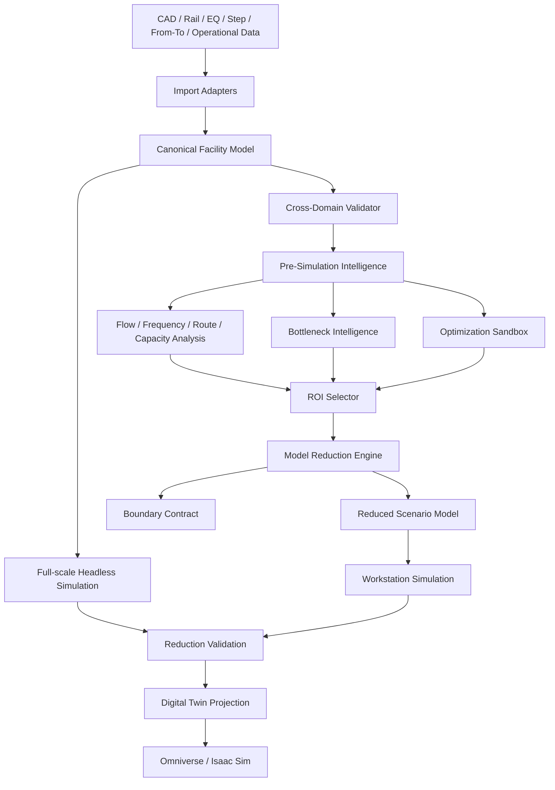

# Sim_Core Simulator Architecture v5

| 항목 | 값 |
|---|---|
| 상태 | 실제 SemiLA 정적분석 결과를 요구사항 수준으로 반영한 기준선 |
| 버전 | 0.5.0 |
| 작성일 | 2026-07-18 |
| 대상 | FAB OHT 차세대 독립 시뮬레이터 및 Digital Twin 플랫폼 |
| 이전 기준 | `SIM_CORE_ARCHITECTURE_V4.md` |

## 1. 변경 결론

Architecture v5는 v4의 `Bottleneck-driven Multi-Scale Simulation`, ROI Model Reduction, One-click Digital Twin 원칙을 유지하면서, 실제 `SemiLA_1204_EXE` 정적분석에서 확인된 기능군을 요구사항 관점에서 재검토해 보강합니다.

SemiLA 자체 구조나 Java 클래스, UI, 템플릿을 복제하지 않습니다. 분석에서 확인된 다음 능력만 Sim_Core 고유 구조로 일반화합니다.

- CAD/DXF와 rail geometry 해석
- rail 연결, 길이, 경로 변환
- EQ List / Step Table / rail 간 교차검증
- From-To / 거리 / route / capacity / storage 분석
- rail frequency / flow 분석
- 로그 / FABScope / OCS / PDS 계열 운영 데이터 분석
- 장비 배치, Manhattan 거리, 장애물 회피, 최적화 문제
- AutoMod 생성 파이프라인에서 확인되는 `중립 모델 -> 검증 -> 분석 -> 시뮬레이터 입력 생성` 패턴

핵심 원칙은 다음입니다.

> **SemiLA는 Reference Tool이고, Sim_Core는 모델링·검증·분석·축소·시뮬레이션·Digital Twin을 하나의 Canonical Model 위에서 연결하는 차세대 플랫폼이다.**

## 2. v4 대비 핵심 보강

v4는 병목 정적분석과 ROI 축소를 중심으로 설계했습니다. 실제 SemiLA 분석 결과를 대조하면 다음 기능은 별도 1급 계층으로 강화할 가치가 있습니다.

1. `Pre-Simulation Intelligence`: 시뮬레이션 전에 정적·준정적 분석으로 구조적 위험을 탐색
2. `Cross-Domain Validation`: CAD, rail, EQ, Step, From-To, capacity, storage 사이 불일치를 자동 검출
3. `Flow Intelligence`: rail frequency, route concentration, OD flow, capacity pressure를 통합 분석
4. `Model Synthesis`: 정제된 Canonical Model과 분석 결과로 reduced model, scenario, digital twin package를 생성
5. `Optimization Sandbox`: 배치·경로·용량·정책 후보를 full simulation 전에 저비용으로 탐색

## 3. 전체 Big Picture



이 구조에서 정적 분석은 시뮬레이션을 대체하지 않습니다. 정적·준정적 분석은 "어디를 자세히 봐야 하는가"와 "어떤 축소가 안전한가"를 결정하는 앞단 지능 계층입니다.

## 4. Cross-Domain Validation Layer

실제 SemiLA 분석에서 CAD/EQ/StepTable/rail 데이터 상호 검증 기능이 확인됐습니다. Sim_Core에서는 이를 범용 `CrossDomainValidator`로 설계합니다.

검증 대상 예시:

- CAD geometry와 rail topology 불일치
- rail endpoint와 station pose 불일치
- EQ ID는 존재하지만 rail attachment가 없는 경우
- Step Table의 출발/도착 EQ가 Canonical Model에 없는 경우
- From-To 수요가 unreachable pair를 참조하는 경우
- storage/capacity 정의와 실제 resource capacity 불일치
- route definition이 단절되거나 금지 구간을 통과하는 경우
- revision 간 entity identity 충돌

```text
CrossDomainDiagnostic
  diagnostic_id
  severity
  category
  source_entities[]
  canonical_entities[]
  rule_id
  message
  evidence
  suggested_action
```

자동 수정은 기본값이 아닙니다. 수정 후보는 제안할 수 있지만 Canonical revision 변경은 명시적으로 생성합니다.

## 5. Pre-Simulation Intelligence

### 5.1 목적

전체 동적 시뮬레이션 전에 저비용 분석으로 병목 후보와 구조적 위험을 찾습니다.

입력:

- topology
- geometry
- OD / From-To demand
- expected arrival rate
- route candidates
- vehicle population
- station/service capacity
- storage capacity
- traffic-control region
- reconstructed operational history

출력:

- FlowMap
- RouteConcentrationMap
- CapacityPressureMap
- StoragePressureMap
- FrequencyMap
- BottleneckCandidate
- OptimizationCandidate

### 5.2 Static와 Quasi-static 구분

`Static`은 topology, geometry, connectivity, centrality, capacity 구조를 봅니다.

`Quasi-static`은 OD demand, expected frequency, service time, route distribution, vehicle population을 결합합니다.

둘 다 확정적인 운영 결과가 아니라 후보 탐색용입니다.

## 6. Flow / Frequency Intelligence

실제 SemiLA 분석에서 `rail frequency·flow`, `From-To·거리·route·capacity·storage 분석` 기능이 확인됐습니다. Sim_Core에서는 이를 하나의 범용 분석 축으로 통합합니다.

```text
FlowAnalysisResult
  analysis_id
  model_revision
  scenario_fingerprint
  edge_flow[]
  node_flow[]
  station_flow[]
  route_frequency[]
  od_frequency[]
  capacity_pressure[]
  storage_pressure[]
  assumptions
```

핵심 지표:

- edge expected traversals / hour
- route share
- OD pair contribution
- merge inflow ratio
- station arrival pressure
- resource utilization estimate
- storage turnover
- capacity margin
- alternate route availability

이 결과는 병목 Heatmap, ROI 선택, 모델 축소, 정책 비교에 공통 입력으로 사용합니다.

## 7. Bottleneck Intelligence 강화

v4의 Bottleneck Intelligence는 유지하되 Flow Intelligence와 결합합니다.

병목 후보 점수는 최소 다음 family를 독립적으로 계산합니다.

- topology score
- route concentration score
- flow frequency score
- capacity pressure score
- storage pressure score
- queue risk score
- blocking propagation score
- deadlock susceptibility score
- historical congestion score

최종 점수는 단일 고정식이 아니라 versioned scoring policy입니다.

중요한 점은 병목의 `원인 설명`을 남기는 것입니다.

```text
BottleneckCandidate
  entity_ids[]
  score
  confidence
  dominant_causes[]
  supporting_metrics
  affected_routes[]
  affected_od_pairs[]
  upstream_pressure
  downstream_escape_capacity
```

## 8. ROI와 Model Reduction 보강

실제 SemiLA에서 확인된 route/frequency/capacity 분석을 이용해 ROI 자동 생성 정확도를 높입니다.

ROI 확장 기준:

- top-N high-frequency edges
- high route concentration corridors
- capacity margin 이하 resource
- dominant OD pair 경로
- upstream queue accumulation region
- downstream recovery region
- alternate path set
- related station/storage group

축소 모델에서 ROI 외부는 다음 등가 요소로 대체할 수 있습니다.

- Equivalent Demand Source
- Boundary Arrival Process
- Boundary Queue
- Delay Distribution
- Fleet Pressure Proxy
- Resource Contention Proxy
- Aggregated Storage/Capacity Proxy

단순 차량 수 축소율은 목표가 아닙니다. 병목 영향 보존이 목표입니다.

## 9. Reduction Validation 강화

축소 모델은 다음 항목을 Full Model과 비교합니다.

- ROI inflow / outflow
- route share
- top-N bottleneck ranking
- queue length distribution
- waiting time distribution
- critical resource utilization
- capacity margin
- blocking duration
- deadlock cycle characteristics
- policy A/B directionality

검증 결과는 목적별 pass/fail 기준을 가집니다.

예:

- 병목 탐색 목적: top-N ranking overlap
- 정책 비교 목적: KPI improvement direction preservation
- queue 분석 목적: percentile error bound
- deadlock 분석 목적: critical wait-for cycle preservation

## 10. Optimization Sandbox

SemiLA 정적분석에서 장비 배치, Manhattan 거리, 컬럼 회피, 유전알고리즘 최적화 기능군이 확인됐습니다. Sim_Core는 특정 알고리즘을 복제하지 않고 범용 Optimization Sandbox를 둡니다.

초기 후보 문제:

- station placement
- parking placement
- charger placement
- route alternative selection
- capacity sizing
- zone boundary tuning
- fleet size screening

Optimization Sandbox는 저비용 surrogate/static evaluator를 먼저 사용하고, 상위 후보만 Reduced Simulation 또는 Full Simulation으로 승격합니다.

```text
Generate Candidates
  -> Fast Static Evaluation
  -> Quasi-static Evaluation
  -> Reduced Simulation
  -> Full Headless Verification
  -> Optional Digital Twin Verification
```

## 11. Model Synthesis Pipeline

SemiLA에서 확인된 AutoMod 생성 파이프라인의 교훈은 특정 AutoMod 템플릿을 재사용하는 것이 아니라, `분석 가능한 중립 모델에서 실행 가능한 산출물을 생성하는 파이프라인`이 중요하다는 점입니다.

Sim_Core에서는 다음으로 일반화합니다.

```text
Raw Engineering Data
 -> Canonical Facility Model
 -> Cross-Domain Validation
 -> Pre-Simulation Intelligence
 -> Scenario Compiler
 -> Reduced Model Generator
 -> Simulation Run Plan
 -> Digital Twin Projection Package
```

하나의 Canonical revision에서 여러 산출물을 생성합니다.

- full run plan
- reduced run plan
- lightweight analysis package
- USD/Isaac Sim package
- replay package
- comparison baseline

## 12. Lightweight Analysis Viewer

애니메이션 없이 다음을 즉시 표시합니다.

- 2D rail topology
- flow/frequency heatmap
- capacity pressure
- storage pressure
- route concentration
- OD contribution
- bottleneck ranking
- unreachable/invalid entities
- ROI preview
- reduction boundary preview

이 Viewer는 GPU 없이 동작해야 합니다.

동일 Overlay Contract는 나중에 Omniverse/Isaac Sim에서도 사용할 수 있습니다.

## 13. Digital Twin과의 연결

Architecture v3의 One-click Digital Twin 구조는 유지합니다.

추가로 v5에서는 병목·flow·capacity 분석 결과도 Digital Twin Projection에 전달할 수 있게 합니다.

예:

- red/orange congestion overlay
- edge flow thickness
- capacity warning
- queue accumulation region
- ROI highlight
- reduced/full model comparison overlay

따라서 사용자는 먼저 2D Lightweight Viewer에서 병목을 찾고, 필요한 구간만 `Open ROI in Digital Twin`으로 승격할 수 있습니다.

## 14. 권장 Package 구조 추가

```text
src/
  analysis/
    validation/
    flow/
    frequency/
    bottleneck/
    capacity/
    storage/
    optimization/
  reduction/
    roi/
    boundary/
    aggregation/
    validation/
  digital_twin/
    projection/
    overlay/
```

Schema:

```text
schemas/
  analysis/
    diagnostics/
    flow/
    bottleneck/
    optimization/
  reduction/
    roi/
    boundary/
    manifest/
    validation/
```

## 15. 단계별 Roadmap 수정

| 단계 | 산출물 | 종료 조건 |
|---|---|---|
| A0 Governance | 자료 권리·보안 경계 | fixture 승인 |
| A1 Canonical Foundation | facility schema, identity, geometry | import/validation 통과 |
| A2 Cross-Domain Validation | CAD/rail/EQ/OD consistency | 주요 불일치 자동 검출 |
| A3 Flow Intelligence | distance, route, frequency, capacity 분석 | 병목 후보 사전 탐색 가능 |
| A4 Headless MVP | DES, routing, dispatch | 정상 시나리오 완주 |
| A5 Bottleneck Intelligence | heatmap, ranking, explanation | top-N 병목 설명 가능 |
| A6 ROI Reduction | boundary-preserving reduced model | 개인 워크스테이션 실행 가능 |
| A7 Reduction Validation | full vs reduced comparison | 목적별 fidelity 기준 충족 |
| A8 Optimization Sandbox | 후보 생성·저비용 평가 | 상위 후보 자동 선별 |
| A9 Digital Twin Projection | USD/Isaac Sim | ROI one-click projection |
| A10 Full-scale Verification | cloud/full model 검증 | 최종 정책 검증 |

## 16. 최종 확정 원칙

- SemiLA는 Reference Tool이며 Target Architecture가 아닙니다.
- 확인된 기능은 요구사항으로만 일반화합니다.
- 정적 분석은 동적 시뮬레이션을 대체하지 않고 탐색 범위를 줄입니다.
- 전체 모델은 Simulation Truth입니다.
- Reduced Model은 특정 질문을 위한 검증 Projection입니다.
- Flow/Frequency/Capacity 분석 결과는 ROI와 축소 경계 생성에 사용합니다.
- Cross-Domain Validation은 simulation 이전 품질 게이트입니다.
- Optimization은 빠른 분석 -> 축소 시뮬레이션 -> 전체 검증의 계층형 구조를 사용합니다.
- Digital Twin은 전체 모델뿐 아니라 ROI만 선택적으로 승격할 수 있어야 합니다.
- Canonical Model에서 분석, 시뮬레이션, 축소, USD Projection이 모두 파생되어야 합니다.
